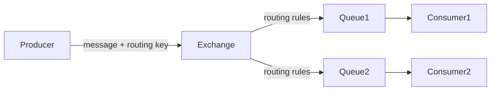

# Tổng Quan Nâng Cao về RabbitMQ và Kiến Trúc Tổng Quan

RabbitMQ là một message broker phổ biến, hỗ trợ trao đổi thông điệp giữa các hệ thống phân tán một cách hiệu quả và linh hoạt. Trong bài viết này, chúng ta sẽ tìm hiểu sâu về kiến trúc tổng quan của RabbitMQ ở mức nâng cao, tập trung vào các thành phần chính như Producer, Consumer, Exchange, Queue, Binding và cách chúng tương tác với nhau. Đồng thời đi sâu vào các loại Exchange (Direct, Fanout, Topic, Headers) cùng các ví dụ cụ thể và hướng dẫn cách lựa chọn Exchange phù hợp cho từng trường hợp sử dụng.

---

## 1. Tổng quan về các thành phần chính của RabbitMQ

### 1.1 Producer (Nhà sản xuất)
Producer là ứng dụng hoặc thành phần chịu trách nhiệm gửi (publish) message tới RabbitMQ. Producer không gửi trực tiếp đến Queue mà gửi đến một Exchange.

### 1.2 Consumer (Người tiêu thụ)
Consumer là ứng dụng hoặc thành phần nhận (consume) message từ các Queue. Consumer sẽ lấy thông điệp từ Queue để xử lý.

### 1.3 Exchange
Exchange là thành phần trung gian nhận message từ Producer và định tuyến (route) message đến một hoặc nhiều Queue dựa trên các quy tắc (routing key và binding).

### 1.4 Queue
Queue là hàng đợi lưu trữ các message chờ được Consumer xử lý. Một message chỉ được deliver đến Queue khi Exchange định tuyến thành công.

### 1.5 Binding
Binding là một mối liên kết giữa Exchange và Queue, xác định cách Exchange định tuyến message tới Queue. Binding sử dụng routing key và các loại matcher tùy thuộc vào loại Exchange.

---

## 2. Sơ đồ kiến trúc tổng quan RabbitMQ



---

## 3. Phân tích sâu kiến trúc

### 3.1 Luồng hoạt động

1. **Producer** gửi message đến **Exchange** kèm theo một routing key.
2. **Exchange** dựa theo loại Exchange và binding với các Queue để xác định Queue nào nhận được message.
3. Message được đẩy vào **Queue** tương ứng.
4. **Consumer** sẽ nhận message từ Queue để xử lý (có thể ack hoặc reject).

---

## 4. Các loại Exchange và cách hoạt động

RabbitMQ cung cấp 4 loại Exchange chính:

### 4.1 Direct Exchange
- Định tuyến message theo chính xác routing key.
- Message sẽ được gửi đến Queue có binding key trùng với routing key của message.
- **Sử dụng cho**: trường hợp truyền message đến một Queue hoặc nhóm Queue cụ thể đồng nhất routing key.

**Ví dụ**:

Binding: Queue1 có binding key = `error`

Message gửi với routing key = `error` => chỉ Queue1 nhận message.

```bash
# Tạo Exchange direct
rabbitmqadmin declare exchange name=logs_direct type=direct

# Tạo Queue
rabbitmqadmin declare queue name=error_logs

# Binding Queue với Exchange bằng routing key "error"
rabbitmqadmin declare binding source=logs_direct destination=error_logs routing_key=error
```

---

### 4.2 Fanout Exchange
- Định tuyến message tới tất cả các Queue được bind với Exchange, bỏ qua routing key.
- **Sử dụng cho**: broadcast message đến tất cả các consumer (ví dụ: thông báo realtime).

**Ví dụ**: 

Nếu Exchange fanout có 3 Queue bind, mỗi message sẽ được gửi đến tất cả 3 Queue bất kể routing key.

```bash
rabbitmqadmin declare exchange name=logs_fanout type=fanout
rabbitmqadmin declare queue name=queue1
rabbitmqadmin declare queue name=queue2

rabbitmqadmin declare binding source=logs_fanout destination=queue1
rabbitmqadmin declare binding source=logs_fanout destination=queue2
```

---

### 4.3 Topic Exchange
- Định tuyến message dựa trên pattern của routing key sử dụng ký tự đại diện:
  - `*` : đại diện cho một từ (word).
  - `#` : đại diện cho 0 hoặc nhiều từ.
- **Sử dụng cho**: cần phân loại message theo chủ đề phức tạp.

**Ví dụ**:

- Routing key: `user.signup.us`
- Binding key: `user.*.*` sẽ nhận message.
- Binding key: `user.#` sẽ nhận tất cả các routing key bắt đầu với `user.`

```bash
rabbitmqadmin declare exchange name=logs_topic type=topic
rabbitmqadmin declare queue name=us_logs
rabbitmqadmin declare binding source=logs_topic destination=us_logs routing_key="user.signup.us"
rabbitmqadmin declare queue name=user_logs
rabbitmqadmin declare binding source=logs_topic destination=user_logs routing_key="user.#"
```

---

### 4.4 Headers Exchange
- Định tuyến dựa trên các header truyền theo message, không dựa vào routing key.
- Binding giữa Exchange-Queue dựa trên thuộc tính header và các điều kiện khớp (match all hoặc match any).
- **Sử dụng cho**: khi routing key không đủ linh hoạt, cần dựa vào metadata message phức tạp.

**Ví dụ**:

Binding queue với yêu cầu header `format=pdf` và `type=report`.

---

## 5. Lựa chọn loại Exchange phù hợp trong các trường hợp sử dụng

| Trường hợp sử dụng                            | Loại Exchange        | Lý do                                                                              |
|----------------------------------------------|----------------------|------------------------------------------------------------------------------------|
| Gửi message đến Queue cụ thể theo routing key | Direct               | Cho phép định tuyến chính xác theo routing key.                                   |
| Gửi broadcast đến tất cả các queue liên quan | Fanout               | Không cần định tuyến theo key, gửi đến tất cả queue bindings.                     |
| Cần routing theo pattern phức tạp             | Topic                | Hỗ trợ routing key sử dụng wildcard `*` và `#`, rất linh hoạt.                    |
| Routing dựa trên metadata trong header        | Headers              | Dựa vào các header cho routing đa chiều, không phụ thuộc routing key.             |

---

## 6. Ví dụ minh họa bằng code Python sử dụng thư viện `pika`

Dưới đây là ví dụ Producer gửi message qua từng loại Exchange:

```python
import pika

connection_params = pika.ConnectionParameters('localhost')
connection = pika.BlockingConnection(connection_params)
channel = connection.channel()

# 1. Direct Exchange
channel.exchange_declare(exchange='direct_logs', exchange_type='direct')
message = "Error log"
routing_key = 'error'
channel.basic_publish(exchange='direct_logs', routing_key=routing_key, body=message)
print(f"Sent '{message}' with routing key '{routing_key}'")

# 2. Fanout Exchange
channel.exchange_declare(exchange='fanout_logs', exchange_type='fanout')
channel.basic_publish(exchange='fanout_logs', routing_key='', body='Fanout message')
print("Sent fanout message")

# 3. Topic Exchange
channel.exchange_declare(exchange='topic_logs', exchange_type='topic')
routing_key = 'user.signup.us'
message = 'User signup event'
channel.basic_publish(exchange='topic_logs', routing_key=routing_key, body=message)
print(f"Sent '{message}' with routing key '{routing_key}'")

# 4. Headers Exchange
channel.exchange_declare(exchange='headers_logs', exchange_type='headers')
headers = {'format': 'pdf', 'type': 'report'}
properties = pika.BasicProperties(headers=headers)
channel.basic_publish(exchange='headers_logs', routing_key='', body='Headers message', properties=properties)
print("Sent headers message")

connection.close()
```

---

## 7. Kết luận

- RabbitMQ với kiến trúc phân tầng giúp quản lý luồng message hiệu quả giữa các Producer và Consumer thông qua Exchange và Queue.
- Hiểu rõ từng thành phần và cách chúng tương tác là bước đầu quan trọng để thiết kế hệ thống message-driven.
- Việc chọn loại Exchange phù hợp sẽ tối ưu hiệu năng và logic routing message, giúp hệ thống mở rộng và bảo trì dễ dàng.
- Tùy vào tính chất bài toán, bạn có thể lựa chọn Direct cho routing đơn giản, Fanout để broadcast, Topic cho routing pattern phức tạp hoặc Headers để routing dựa trên metadata mạnh mẽ.

Hy vọng bài viết đã giúp bạn có được cái nhìn nâng cao và chi tiết về kiến trúc RabbitMQ cũng như các thành phần và loại Exchange đóng vai trò cốt lõi trong việc xây dựng các hệ thống trao đổi thông điệp hiệu quả. Nếu cần, bạn có thể thử triển khai các ví dụ trên để làm quen và hiểu sâu hơn.

---

Nếu bạn có thắc mắc hoặc muốn tìm hiểu thêm phần nào, hãy để lại câu hỏi nhé!