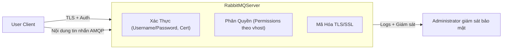

# Khám Phá Các Cơ Chế Bảo Mật Trong RabbitMQ

RabbitMQ là một trong những hệ thống message broker phổ biến, được sử dụng rộng rãi để xây dựng các ứng dụng phân tán, microservices. Tuy nhiên, khi triển khai trong môi trường thực tế, bảo mật RabbitMQ là vô cùng quan trọng để đảm bảo rằng các tin nhắn và dịch vụ không bị truy cập trái phép hay tấn công.

Bài viết này tập trung **khám phá các cơ chế bảo mật nền tảng trong RabbitMQ**, bao gồm:

- Xác thực người dùng (Authentication)
- Phân quyền truy cập (Authorization / Permissions)
- Mã hóa kênh giao tiếp (TLS/SSL)
- Các best practices (thực hành tốt) trong bảo mật RabbitMQ

---

## 1. Xác Thực Người Dùng (Authentication)

RabbitMQ hỗ trợ nhiều phương thức xác thực, gồm:

- **username/password**: đạt được qua file cấu hình hoặc plugin backend như LDAP.
- **X.509 certificate**: sử dụng khi client dùng TLS client certificate để xác thực.
- **OAuth2**, **External mechanisms** (như SASL)

### Tạo người dùng mới trong RabbitMQ

Bạn có thể tạo user bằng command line:

```bash
rabbitmqctl add_user alice StrongPassword123
```

Để đặt tag quản trị (để có quyền admin):

```bash
rabbitmqctl set_user_tags alice administrator
```

Xác thực cơ bản sẽ dựa trên username/password này khi client kết nối.

### Xác minh user thông qua plugin LDAP (đơn cử)

RabbitMQ hỗ trợ plugin LDAP, cho phép tích hợp xác thực với hệ thống LDAP doanh nghiệp.

Ví dụ cấu hình plugin `rabbitmq_auth_backend_ldap` trong file `rabbitmq.conf`:

```ini
auth_backends.1 = ldap
auth_backends.2 = internal

ldap.servers = ldap.company.com
ldap.user_dn_pattern = cn=${username},ou=Users,dc=company,dc=com
ldap.port = 389
ldap.use_ssl = false
ldap.timeout = 5000
```

---

## 2. Phân Quyền Truy Cập (Authorization / Permissions)

Sau khi đã xác thực, RabbitMQ cho phép gán quyền hạn với từng user trên từng virtual host (vhost). Mỗi user được cấp quyền trên:

- Configure (quyền tạo queue, exchange...)
- Write (quyền gửi message)
- Read (quyền nhận message)

### Thiết lập quyền cho user

Cú pháp:

```bash
rabbitmqctl set_permissions -p <vhost> <username> "<configure_regex>" "<write_regex>" "<read_regex>"
```

Ví dụ:

```bash
rabbitmqctl set_permissions -p / alice "^amq\." ".*" ".*"
```

- `^amq\.`: chỉ cho phép user `alice` configure queue/exchange bắt đầu với `amq.`.
- `.*`: write và read với tất cả các queue/exchange.

Bạn có thể giới hạn quyền trong phạm vi chính xác bằng các regex này. 

### Kiểm tra permissions

```bash
rabbitmqctl list_user_permissions alice
```

### Cấu trúc virtual hosts

RabbitMQ phân vùng resource theo virtual host, giúp cô lập các module, dịch vụ, hoặc môi trường (dev/staging/prod).

---

## 3. Mã Hóa Kênh Giao Tiếp (TLS/SSL)

Việc mã hóa kênh giao tiếp giúp bảo vệ dữ liệu đang truyền tránh bị nghe lén hoặc chỉnh sửa.

RabbitMQ hỗ trợ TLS cho các kết nối AMQP, HTTP API, và các plugin như MQTT.

### Cấu hình ví dụ cho TLS trên AMQP (file `rabbitmq.conf`):

```ini
listeners.tcp = none

listeners.ssl.default = 5671
ssl_options.cacertfile = /etc/rabbitmq/ca_certificate.pem
ssl_options.certfile   = /etc/rabbitmq/server_certificate.pem
ssl_options.keyfile    = /etc/rabbitmq/server_key.pem
ssl_options.verify     = verify_peer
ssl_options.fail_if_no_peer_cert = true
```

- `verify_peer`: yêu cầu client cung cấp certificate.
- `fail_if_no_peer_cert`: từ chối nếu client không cung cấp cert.

### Ví dụ client kết nối AMQP qua TLS bằng Python (pika):

```python
import pika
import ssl

context = ssl.create_default_context(cafile="/path/to/ca_certificate.pem")
context.load_cert_chain("/path/to/client_certificate.pem", "/path/to/client_key.pem")

ssl_options = pika.SSLOptions(context, "your.rabbitmq.server")

params = pika.ConnectionParameters(
    host='your.rabbitmq.server',
    port=5671,
    ssl_options=ssl_options,
    credentials=pika.PlainCredentials('alice', 'StrongPassword123')
)

connection = pika.BlockingConnection(params)
channel = connection.channel()
```

---

## 4. Các Best Practices Để Bảo Vệ RabbitMQ

| Mục tiêu                         | Thực hành đề xuất                                                                              |
|---------------------------------|-----------------------------------------------------------------------------------------------|
| **Hạn chế tài khoản admin**      | Chỉ cấp quyền `administrator` cho user thực sự cần; ưu tiên role dạng least privilege.        |
| **Sử dụng virtual host riêng**   | Tách biệt service, team, hoặc môi trường bằng vhost để cô lập quyền truy cập.                  |
| **Đặt mật khẩu đủ mạnh**         | Áp dụng quy tắc mật khẩu phức tạp, hạn chế người dùng mặc định (guest).                       |
| **Kích hoạt TLS toàn bộ kết nối**| Mã hóa dữ liệu trên mạng tránh bị nghe trộm và nâng cao bảo mật cho client-server.            |
| **Giám sát hoạt động**            | Kích hoạt logging, giám sát các hành vi đăng nhập thất bại, truy cập bất thường.              |
| **Sử dụng firewall**              | Giới hạn IP được phép kết nối RabbitMQ service (5672, 5671).                                |
| **Cập nhật RabbitMQ thường xuyên**| Vá các lỗ hổng bảo mật có thể phát sinh trong các phiên bản cũ.                             |
| **Kiểm soát plugin**              | Cho phép các plugin cần thiết, vô hiệu hóa plugin không dùng để giảm bề mặt tấn công.          |

---

## 5. Diagram Tổng Quan Cơ Chế Bảo Mật RabbitMQ



---

# Kết Luận

- RabbitMQ cung cấp cơ chế bảo mật đầy đủ, bao gồm xác thực, phân quyền, mã hóa dữ liệu truyền tải.
- Việc cấu hình một cách chuẩn chỉnh theo các best practices sẽ đảm bảo hệ thống message broker an toàn, tránh rò rỉ, truy cập trái phép, hoặc bị tấn công.
- Người vận hành nên nghiên cứu kỹ các tùy chọn này để áp dụng vào môi trường thực tế phù hợp với yêu cầu và mức độ bảo mật cần thiết.

---

Nếu bạn cần mẫu cấu hình hay ví dụ code chi tiết hơn cho từng phần, hãy cho biết nhé!