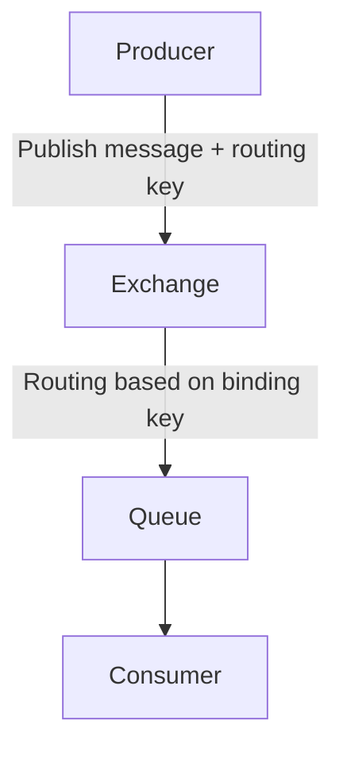

# Tổng Quan và Kiến Trúc Nâng Cao của RabbitMQ

RabbitMQ là một hệ thống message broker mã nguồn mở rất phổ biến, đóng vai trò trung gian giúp các ứng dụng gửi nhận và trao đổi dữ liệu thông qua các thông điệp (messages). Ngày đầu tiên học tập về RabbitMQ sẽ tập trung vào củng cố kiến thức nền tảng và khám phá các khía cạnh nâng cao thông qua phân tích kiến trúc, các thành phần cơ bản và nâng cao, cũng như các kỹ thuật tối ưu hiệu năng và mở rộng tính năng.

---

## 1. Kiến trúc tổng quan của RabbitMQ

RabbitMQ hoạt động dựa trên mô hình message broker trung gian, trong đó:

- **Producer**: Đóng vai trò gửi message vào hệ thống.
- **Broker (RabbitMQ Server)**: Nhận và quản lý các message.
- **Exchange**: Thành phần chịu trách nhiệm nhận message từ producer và quyết định định tuyến đến các queue tương ứng.
- **Queue**: Nơi lưu trữ các message chờ được consumer lấy ra xử lý.
- **Binding**: Liên kết giữa Exchange và Queue với điều kiện routing đặc trưng.
- **Consumer**: Ứng dụng hoặc dịch vụ nhận message từ Queue để xử lý.

---

## 2. Thành phần chi tiết của RabbitMQ

### 2.1. Broker

Là trung tâm của RabbitMQ, chịu trách nhiệm lưu trữ, truyền tải và đảm bảo độ tin cậy của các message.

### 2.2. Exchange

Exchange nhận các message từ Producer và định tuyến chúng tới một hoặc nhiều queue dựa trên các rules được cấu hình trong binding. RabbitMQ có 4 loại Exchange phổ biến:

- **Direct Exchange**: Định tuyến message dựa trên routing key chính xác.
- **Topic Exchange**: Định tuyến dựa trên pattern matching giữa routing key và binding key (sử dụng dấu `*` và `#`).
- **Fanout Exchange**: Phân phối message đến tất cả các queue được liên kết, bỏ qua routing key.
- **Headers Exchange**: Định tuyến dựa trên các header key-value chứ không dựa vào routing key.

### 2.3. Queue

Nơi lưu trữ message trước khi consumer lấy và xử lý.

### 2.4. Binding

Là sự liên kết giữa Exchange và Queue theo một điều kiện routing cụ thể (binding key hoặc header).

---

## 3. Phân tích các loại Exchange nâng cao

### 3.1. Direct Exchange

Định tuyến message đến queue có binding key chính xác bằng routing key của message.

Ví dụ:

```bash
Routing key: "error"
Binding key queue A: "error"
Binding key queue B: "info"
Message với routing key "error" sẽ vào queue A.
```

### 3.2. Topic Exchange

Cho phép định tuyến dựa trên mẫu chuỗi với dấu `*` (một phần tử) và `#` (nhiều phần tử).

Ví dụ:

- Binding key: `log.*`
- Message routing key: `log.error` -> match
- Message routing key: `log.error.urgent` -> không match
- Binding key: `log.#`
- Message routing key: `log.error.urgent` -> match

### 3.3. Fanout Exchange

Phân phối message tới mọi queue liên kết mà không quan tâm đến routing key.

Dùng cho broadcast hoặc pub-sub.

### 3.4. Headers Exchange

Routing dựa trên các headers kèm theo trong message, phù hợp khi routing logic phức tạp hơn.

---

## 4. Cơ chế routing messages trong RabbitMQ

Routing message liên quan đến việc xác định queue nhận message dựa trên exchange, routing key và binding key/headers.

1. Producer gửi message kèm routing key đến Exchange.
2. Exchange dựa vào loại và ràng buộc của nó với queue để xác định nơi gửi message.
3. Message vào queue chờ được consumer lấy ra xử lý.

---

## 5. Cách cấu hình và tinh chỉnh các tham số tối ưu hiệu năng

- **Prefetch count**: Giới hạn số message chưa ack mà consumer có thể nhận, giúp cân bằng tải.
- **Message TTL (Time-To-Live)**: Thời gian sống của message trong queue trước khi bị loại bỏ.
- **Queue TTL**: Thời gian tồn tại của queue.
- **Dead Letter Exchange**: Queue chứa các message không thể xử lý hoặc hết hạn.
- **Persistence**: Ghi message và queue xuống đĩa để đảm bảo không mất dữ liệu khi server restart.
- **Publisher confirms & Consumer acknowledgements**: Đảm bảo thông điệp không bị mất.

### Ví dụ cấu hình prefetch trong RabbitMQ client (Python pika):

```python
channel.basic_qos(prefetch_count=10)
```

---

## 6. Mô hình Messaging Patterns phổ biến với RabbitMQ

- **Work Queues (Task Queues)**: Producer gửi tasks vào queue, nhiều consumer lấy và xử lý song song.
- **Publish/Subscribe (Fanout Exchange)**: Gửi broadcast message đến nhiều consumer.
- **Routing (Direct Exchange)**: Định tuyến thông điệp cụ thể.
- **Topics**: Phân phối message dựa trên nhu cầu lọc theo pattern.
- **RPC (Remote Procedure Call)**: Cấu hình queue trả lời riêng cho yêu cầu gọi hàm từ xa.

---

## 7. Sử dụng Plugin để mở rộng tính năng RabbitMQ

RabbitMQ hỗ trợ nhiều plugin giúp mở rộng các chức năng:

- **Management plugin**: Giao diện web quản lý và giám sát RabbitMQ.
- **Shovel plugin**: Di chuyển message giữa các broker RabbitMQ.
- **Federation plugin**: Liên kết nhiều RabbitMQ cluster.
- **STOMP, MQTT, AMQP 1.0 plugins**: Hỗ trợ các giao thức message khác nhau.
- **Tracing plugin**: Giúp thu thập log message phục vụ debug.

---

## 8. Diagram tổng quan kiến trúc RabbitMQ



---

## 9. Ví dụ minh họa (Python pika) với Exchange type Topic

```python
import pika

connection = pika.BlockingConnection(pika.ConnectionParameters('localhost'))
channel = connection.channel()

# Tạo exchange kiểu topic
channel.exchange_declare(exchange='topic_logs', exchange_type='topic')

# Khai báo queue tạm thời (auto-delete, exclusive)
result = channel.queue_declare(queue='', exclusive=True)
queue_name = result.method.queue

# Binding keys cho queue lắng nghe các log liên quan đến "error"
binding_keys = ['*.error', 'kern.*']

for binding_key in binding_keys:
    channel.queue_bind(exchange='topic_logs', queue=queue_name, routing_key=binding_key)

print(' [*] Waiting for logs. To exit press CTRL+C')

def callback(ch, method, properties, body):
    print(f" [x] Received {method.routing_key}: {body.decode()}")

channel.basic_consume(queue=queue_name, on_message_callback=callback, auto_ack=True)
channel.start_consuming()
```

---

# Kết luận

Ngày đầu tiên học RabbitMQ nên tập trung vào việc:

- Hiểu rõ kiến trúc, các thành phần Broker, Exchange, Queue, Binding.
- Nắm vững các loại Exchange và cơ chế routing.
- Cấu hình và tinh chỉnh các thông số để tối ưu hiệu năng.
- Thực hành các mẫu messaging phổ biến.
- Tìm hiểu thêm về plugin mở rộng giúp quản lý và xử lý message linh hoạt hơn.

Hy vọng với phần tổng quan và kiến trúc nâng cao này, bạn sẽ có nền tảng vững chắc để tiếp tục khai thác hiệu quả RabbitMQ cho các dự án phức tạp hơn sau này.