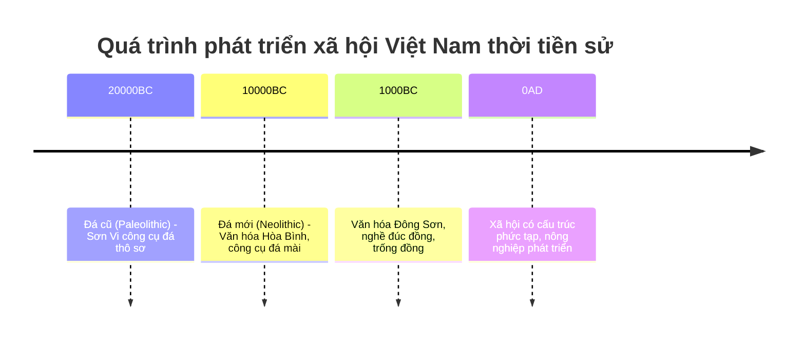

# Khởi nguồn lịch sử Việt Nam – Thời kỳ tiền sử và Văn hóa Đông Sơn

Lịch sử Việt Nam có một hành trình lâu dài và phong phú bắt đầu từ thời kỳ tiền sử, với những dấu tích khảo cổ quan trọng như các di chỉ Sơn Vi, Hòa Bình và đặc biệt là Văn hóa Đông Sơn. Qua bài viết này, chúng ta sẽ cùng tìm hiểu về bản đồ Việt Nam thời tiền sử, các di chỉ khảo cổ quan trọng đã giúp làm sáng tỏ quá trình phát triển của con người tại đây, cũng như liên hệ với hiện thực hiện nay thông qua các hiện vật đặc sắc như trống đồng Đông Sơn – biểu tượng quốc gia và ý nghĩa của nông nghiệp trong sự phát triển xã hội.

---

## 1. Bản đồ Việt Nam thời tiền sử và các di chỉ khảo cổ quan trọng

### 1.1. Bản đồ Việt Nam thời tiền sử

Việt Nam nằm trong khu vực Đông Nam Á, với địa hình đa dạng gồm các vùng đồng bằng, trung du, và miền núi, tạo điều kiện thuận lợi cho sự phát triển của các cộng đồng người tiền sử từ cách đây hàng vạn năm. Khu vực khảo cổ chính trải dài từ Bắc Bộ đến Trung Bộ và phía Nam.

Dưới đây là sơ đồ bản đồ Việt Nam thời tiền sử với các địa điểm di chỉ khảo cổ tiêu biểu:

```
+-------------------------+
|                         |
|  Sơn Vi (Phú Thọ)       |  <-- Bắc Bộ, di chỉ mẫu mực của thời kỳ Đá cũ
|                         |
|         Hòa Bình (Hòa Bình)  |  <-- Bắc Bộ, văn hóa Hòa Bình, nổi bật với công cụ đá và lối sống săn bắt hái lượm
|                         |
|                         |
|               Văn hóa Đông Sơn (Thanh Hóa - Bắc Trung Bộ) |  <-- vùng Đông Sơn, nền văn hóa phát triển với nghề luyện kim đồng
|                         |
+-------------------------+
```

### 1.2. Di chỉ Sơn Vi (Phú Thọ)

- Sơn Vi là một trong những di chỉ tiền sử tiêu biểu ở Việt Nam, được phát hiện tại khu vực miền núi Phú Thọ.
- Thời kỳ này thuộc giai đoạn Đá cũ (Paleolithic), cách đây khoảng 20.000 – 10.000 năm.
- Người Sơn Vi sống chủ yếu bằng săn bắt, hái lượm với các công cụ đá thô sơ.
- Các hiện vật tìm thấy chủ yếu là rìu đá, mảnh đá mài, xương động vật.

### 1.3. Di chỉ văn hóa Hòa Bình (Hòa Bình)

- Nằm trong khu vực Bắc Bộ, văn hóa Hòa Bình phát triển vào thời kỳ Đá mới, cách đây khoảng 10.000 – 4.000 năm.
- Có sự phát triển hơn về công cụ đá mài, hình thức sống săn bắt, hái lượm có tổ chức hơn.
- Người Hòa Bình đã biết sử dụng vũ khí như cung tên, phát triển nghề hái lượm và biết làm rẫy nhỏ.
- Đây cũng là nơi phát hiện hình thức chế tác công cụ đá đặc trưng gọi là "công cụ Hòa Bình".

### 1.4. Văn hóa Đông Sơn (Thanh Hóa và các vùng lân cận)

- Văn hóa Đông Sơn phát triển mạnh từ khoảng 1000 trước Công nguyên đến khoảng thế kỷ 1 sau Công nguyên.
- Đây là giai đoạn chuyển tiếp từ xã hội nguyên thủy sang xã hội có sự phân công lao động rõ ràng, có tổ chức xã hội phát triển.
- Nổi bật với nghề luyện kim đồng, chế tác trống đồng và các đồ đồng tinh xảo.
- Các di chỉ Đông Sơn được tìm thấy nhiều ở Thanh Hóa, Nghệ An, Sơn La, Hà Nội...
  
---

## 2. Các hiện vật tiêu biểu và ý nghĩa liên hệ với thực tế hiện nay

### 2.1. Trống đồng Đông Sơn – biểu tượng quốc gia

- Trống đồng Đông Sơn là hiện vật quan trọng và nổi tiếng nhất của nền văn hóa Đông Sơn.
- Được đúc bằng đồng với hoa văn phong phú, có giá trị nghệ thuật cũng như lịch sử.
- Trống đồng không những dùng trong nghi lễ, tang lễ mà còn là biểu tượng quyền lực và văn hóa của người Việt cổ.
- Hiện nay, trống đồng Đông Sơn được coi là biểu tượng văn hóa quốc gia, thể hiện sự liên tục của lịch sử dân tộc.
  

*Hình ảnh: Trống đồng Đông Sơn – bảo vật quốc gia (Nguồn: Wikipedia)*

### 2.2. Tầm quan trọng của nông nghiệp trong phát triển xã hội

- Dưới sự tác động của thiên nhiên và những kỹ thuật mới từ thời kỳ Đá mới, người Việt cổ đã bắt đầu biết trồng trọt, đặc biệt là lúa nước.
- Nông nghiệp giúp ổn định nguồn lương thực, tăng dân số và phát triển các cộng đồng phức tạp hơn.
- Nền nông nghiệp lúa nước trở thành nền tảng cho sự phát triển lâu dài của xã hội Việt Nam từ thời kỳ Văn hóa Đông Sơn cho đến ngày nay.
- Văn hóa Đông Sơn cũng chứng minh sự phát triển kỹ thuật kim khí để chế tạo công cụ nông nghiệp như dao, liềm đồng, góp phần năng suất lao động tăng.

---

## 3. Tổng kết và liên hệ thực tế

- Qua các di chỉ khảo cổ như Sơn Vi, Hòa Bình và Văn hóa Đông Sơn, chúng ta hiểu rõ hơn về quá trình hình thành và phát triển xã hội Việt Nam từ thời tiền sử.
- Bản đồ khảo cổ thể hiện sự phân bố cư trú trải dài và gắn liền với điều kiện địa lý, khí hậu đa dạng của Việt Nam.
- Hiện vật trống đồng Đông Sơn không chỉ là minh chứng cụ thể cho trình độ công nghệ đúc đồng và văn hóa thời kỳ Đông Sơn mà còn là di sản văn hóa quan trọng được bảo tồn và tôn vinh trong nước hiện nay.
- Tầm quan trọng của nông nghiệp – đặc biệt là nông nghiệp lúa nước – tạo nền tảng ổn định đời sống, thúc đẩy sự phát triển của xã hội, hình thành các làng xã, thành thị đầu tiên.
  
---

## Tài liệu tham khảo

- Lý Thị Bích Hậu (2020), *Lịch sử Việt Nam thời kỳ tiền sử và sơ sử*, Nhà xuất bản giáo dục Việt Nam.
- Đỗ Văn Ninh (2015), *Văn hóa Đông Sơn – Điểm sáng của lịch sử Việt Nam*, Tạp chí Khoa học Xã hội Việt Nam.
- Wikipedia, *Văn hóa Đông Sơn*, https://vi.wikipedia.org/wiki/Văn_hóa_Đông_Sơn

---

## Biểu đồ minh họa các giai đoạn phát triển xã hội và hiện vật



---

Hy vọng bài viết giúp bạn nắm rõ được khởi nguồn lịch sử Việt Nam qua các di chỉ thời tiền sử và đặc điểm nổi bật của văn hóa Đông Sơn, cùng tầm quan trọng của các hiện vật đối với việc hiểu biết và giữ gìn di sản văn hóa quốc gia ngày nay. Nếu cần giúp đỡ thêm về chủ đề này hoặc mở rộng, bạn cứ hỏi nhé!