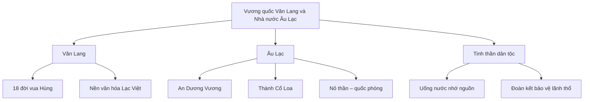

# Các Vương quốc Cổ đại và Nhà nước Văn Lang – Âu Lạc

Lịch sử Việt Nam có nguồn gốc từ thời kỳ các vương quốc cổ đại đầu tiên. Trong đó, **Văn Lang** và **Âu Lạc** là hai quốc gia tiền đề quan trọng, thể hiện sự hình thành nền văn hóa, chính trị và tinh thần dân tộc đặc trưng của người Việt.

---

## 1. Vương quốc Văn Lang – Nhà nước đầu tiên của người Việt

### 1.1 Lịch sử hình thành và vai trò

- Văn Lang được xem là nhà nước đầu tiên của người Việt cổ, do các vua Hùng truyền nối trị vì.
- Truyền thuyết kể rằng, **vua Hùng Vương thứ nhất** là người tổ chức và thống nhất các bộ tộc Lạc Việt sinh sống dọc vùng đồng bằng sông Hồng.
- Các vua Hùng trị vì 18 đời, tương đương với một khoảng thời gian dài, đặt nền móng cho sự phát triển văn hóa và xã hội người Việt cổ.

### 1.2 Sự tích 18 đời vua Hùng

- Truyện kể rằng từ đời vua Hùng đầu tiên, nối tiếp là 17 đời vua khác, mỗi đời có tên húy riêng như Hùng Duệ Vương, Hùng Hiền Vương,... 
- Dù có sự khác biệt nhỏ trong từng truyền thuyết, nhưng điểm chung là sự nối truyền liên tục, thể hiện sự ổn định và phát triển.
- Hình tượng vua Hùng trở thành biểu tượng linh thiêng, kết tinh tinh thần dân tộc và truyền thống “uống nước nhớ nguồn”.

---

## 2. Nhà nước Âu Lạc và thành Cổ Loa

### 2.1 Sự ra đời của Âu Lạc

- Vào khoảng thế kỷ thứ III trước Công nguyên, nhà lãnh đạo **An Dương Vương**, con cháu người Tiên, đã hợp nhất hai bộ tộc Âu Việt và Lạc Việt thành nhà nước **Âu Lạc**.
- Âu Lạc trở thành một quốc gia có tổ chức chính quyền tập trung hơn, phát triển nền kinh tế và phòng thủ vững chắc.

### 2.2 Thành Cổ Loa – biểu tượng của sự phát triển và quốc phòng

- Thành **Cổ Loa** là kinh đô của nhà nước Âu Lạc, nổi tiếng với kiến trúc thành quách độc đáo gồm 3 vòng thành đồng tâm, được xây dựng rất kỳ công.
- Truyền thuyết về **nỏ thần An Dương Vương** được gắn liền với thành Cổ Loa, thể hiện sức mạnh và chiến thuật trong phòng thủ chống ngoại xâm.
- Thành Cổ Loa không chỉ là trung tâm chính trị mà còn là biểu tượng cho sự kiên cường, đoàn kết của người dân thời đó.

---

## 3. Liên hệ với truyền thống cội nguồn và tinh thần dân tộc

- Văn Lang – Âu Lạc là nguồn gốc sâu xa nhất của người Việt, nhắc nhớ mỗi người dân về **truyền thống “uống nước nhớ nguồn”**, biết ơn tổ tiên và gìn giữ đất nước.
- Tinh thần đoàn kết trong cộng đồng được phát huy mạnh mẽ, từ hợp nhất các bộ tộc đến xây dựng các thành trì phòng thủ.
- Việc bảo vệ lãnh thổ, chống lại các thế lực xâm lược trong lịch sử, từ thời các vua Hùng đến An Dương Vương, là bài học quý giá về lòng yêu nước và sự kiên cường.

---

## 4. Tổng kết kiến thức (Mindmap)

---

## 5. Ví dụ minh họa

- **Ví dụ về truyền thống:** Mỗi năm, người Việt vẫn tổ chức lễ **Giỗ Tổ Hùng Vương** vào ngày mùng 10 tháng 3 âm lịch, tưởng nhớ các vua Hùng cũng như khẳng định cội nguồn dân tộc.
- **Ví dụ về lòng đoàn kết:** Trong lịch sử, sự hợp lực giữa các bộ tộc Lạc Việt dưới triều vua Hùng, rồi đến việc An Dương Vương xây dựng thành Cổ Loa, đều thể hiện sức mạnh tập thể chống lại giặc ngoại xâm.

---

# Kết luận

Nhà nước Văn Lang với các vua Hùng và Âu Lạc dưới thời An Dương Vương không chỉ là những dấu mốc lịch sử quan trọng mà còn là nền tảng hình thành tinh thần yêu nước, sự đoàn kết và bảo vệ lãnh thổ của người Việt từ thuở ban đầu. Hiểu về lịch sử các vương quốc cổ đại giúp chúng ta trân trọng hơn truyền thống và hành động có ý thức trong việc giữ gìn và phát triển đất nước hôm nay.