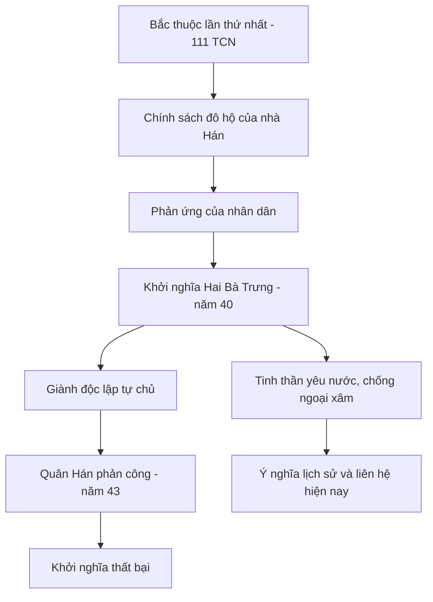

# Tìm hiểu sự kiện Bắc thuộc lần thứ nhất và phong trào khởi nghĩa Hai Bà Trưng

---

## 1. Bắc thuộc lần thứ nhất là gì?

**Bắc thuộc lần thứ nhất** diễn ra vào khoảng năm 111 TCN khi nhà Hán (Trung Quốc) tiến hành mở rộng lãnh thổ và sáp nhập đất nước ta vào hệ thống cai trị của họ. Đây là giai đoạn đầu tiên đất nước ta rơi vào ách đô hộ của phương Bắc trong lịch sử.

### Hoàn cảnh lịch sử
- Trước đó, nước ta, vùng Giao Chỉ, từng là một phần của nhà Triệu Trung Hoa nhưng có sự tự chủ nhất định.
- Năm 111 TCN, nhà Hán dùng quân đội xâm chiếm và đô hộ khu vực Giao Chỉ, biến đây thành một quận trong hệ thống hành chính của nhà Hán.
- Đây là thời kỳ Bắc thuộc đầu tiên trong hơn 1.000 năm lịch sử bị đô hộ phương Bắc.

## 2. Chính sách đô hộ của nhà Hán với Giao Chỉ

Nhà Hán khi đô hộ đã áp dụng nhiều chính sách nhằm đồng hóa và kiểm soát người dân Giao Chỉ:

- **Chính trị**: Thiết lập bộ máy cai trị do người Hán đứng đầu, áp đặt các quan lại người Hán vào vị trí quan trọng tại quận Giao Chỉ.
- **Hành chính**: Thành lập các quận huyện theo mô hình của nhà Hán để quản lý dân cư.
- **Văn hóa – xã hội**: Ép buộc người dân sử dụng chữ Hán, nghi thức, phong tục tập quán của người Hán.
- **Kinh tế**: Thu thuế nặng, bóc lột nông dân, khai thác tài nguyên.
- Chính sách này gây ra sự bất bình, đau khổ cho nhân dân bản địa, làm dấy lên phong trào đấu tranh chống đô hộ.

---

## 3. Cuộc khởi nghĩa Hai Bà Trưng (năm 40 - 43)

### Tiểu sử và nhân vật chính

- **Hai Bà Trưng**: Trưng Trắc và Trưng Nhị là hai chị em con nhà quý tộc, có truyền thống yêu nước.
- Trưng Trắc kết hôn với Thi Sách, một thủ lĩnh yêu nước chống nhà Hán.
- Khi Thi Sách bị giết hại do sự phản bội của thái thú Tô Định, Hai Bà đã phát động cuộc khởi nghĩa.

### Diễn biến cuộc khởi nghĩa

| Năm | Sự kiện chính                                |
|------|--------------------------------------------|
| 40   | Hai Bà Trưng tập hợp lực lượng nổi dậy khởi nghĩa chống đô hộ nhà Hán. |
| 40   | Quân khởi nghĩa giành thắng lợi liên tiếp, đánh bại quân Hán và giải phóng các quận Giao Chỉ, Cửu Chân, Nhật Nam. |
| 41-42| Hai Bà Trưng lên làm vua, lập chính quyền tự chủ đầu tiên sau thời kỳ Bắc thuộc lần thứ nhất. |
| 43   | Quân Hán do Mã Viện chỉ huy tấn công phản công, đánh bại cuộc khởi nghĩa. Hai Bà Trưng hy sinh khi chiến tranh kết thúc. |

### Ý nghĩa cuộc khởi nghĩa

- **Khẳng định tinh thần yêu nước, ý chí độc lập, tự do của dân tộc**.
- Là **phong trào chống ngoại xâm đầu tiên** trong lịch sử Việt Nam có tổ chức dưới sự lãnh đạo của phụ nữ.
- Ghi dấu ấn sâu đậm trong truyền thống đấu tranh chống giặc ngoại xâm.
- Được xem là nguồn cảm hứng cho các phong trào đấu tranh sau này.

---

## 4. Ý nghĩa lịch sử của phong trào khởi nghĩa Hai Bà Trưng

- **Khẳng định truyền thống đấu tranh kiên cường chống áp bức, hà khắc của dân tộc Việt Nam**.
- Tạo cơ sở để các thế hệ tiếp theo tiếp tục cuộc chiến giành độc lập dân tộc.
- Phản ánh sức mạnh đoàn kết dân tộc cùng lòng yêu nước sâu sắc, không chấp nhận bị đô hộ.
- Tinh thần Hai Bà Trưng vẫn được tôn vinh và ghi nhớ trong lịch sử, văn hóa dân tộc và giáo dục cho các thế hệ sau.

---

## 5. Liên hệ tinh thần yêu nước với đời sống hiện nay

- Tinh thần **yêu nước, đoàn kết chống giặc ngoại xâm** vẫn luôn là giá trị cốt lõi trong lịch sử và hiện tại.
- Ngày nay, tuy không còn chiến tranh chống xâm lược bằng vũ lực, nhưng tình trạng **bảo vệ chủ quyền quốc gia, phát triển kinh tế, văn hóa** là những "mặt trận" thế hệ trẻ cần dấn thân.
- Ví dụ:
  - Bảo vệ biển đảo trước các thế lực xâm phạm chủ quyền biển đảo của nước ta.
  - Đẩy mạnh phát triển khoa học – công nghệ, nâng cao vị thế quốc tế.
  - Tôn vinh và gìn giữ bản sắc văn hóa dân tộc.
- Các cuộc vận động giáo dục lòng yêu nước, đấu tranh chống các luận điệu xuyên tạc, bịa đặt chống phá đất nước cũng là biểu hiện của tinh thần ấy.

---

## III. Tóm tắt ý chính

```markdown
- Năm 111 TCN, nhà Hán đô hộ nước ta, bắt đầu thời kỳ Bắc thuộc lần thứ nhất.
- Nhà Hán thiết lập bộ máy cai trị, áp đặt văn hóa, thu thuế nặng, gây bất bình.
- Năm 40, Hai Bà Trưng phát động khởi nghĩa, thắng lợi, lập chính quyền độc lập.
- Năm 43, quân Hán đánh bại, kết thúc khởi nghĩa.
- Phong trào khẳng định tinh thần yêu nước, chống ngoại xâm của dân tộc.
- Tinh thần ấy vẫn được phát huy trong đời sống hiện nay qua bảo vệ chủ quyền và phát triển đất nước.
```

---

## Diagram minh hoạ phong trào khởi nghĩa Hai Bà Trưng



---

# Kết luận

Phong trào khởi nghĩa Hai Bà Trưng trong bối cảnh Bắc thuộc lần thứ nhất là một biểu tượng sáng ngời của tinh thần yêu nước và khát vọng tự do của dân tộc Việt Nam. Bài học từ cuộc khởi nghĩa này mãi còn nguyên giá trị, giúp thế hệ hôm nay và mai sau luôn tự hào, giữ gìn và phát huy truyền thống đấu tranh chống ngoại xâm, bảo vệ vững chắc Tổ quốc.

---

Nếu bạn cần thêm ví dụ hay mở rộng phần nào, bạn cứ yêu cầu nhé!