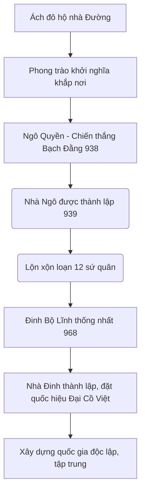

# Thời kỳ độc lập tự chủ đầu tiên – Nhà Ngô và Nhà Đinh  
## 1. Giới thiệu chung  
Thời kỳ độc lập tự chủ đầu tiên của Việt Nam trong lịch sử dân tộc đánh dấu bước ngoặt quan trọng khi nhân dân Việt Nam thoát khỏi ách đô hộ của nhà Đường (Trung Quốc), hình thành nên nền độc lập tự chủ đầu tiên, với sự thành lập của hai triều đại tiêu biểu: Nhà Ngô và Nhà Đinh. Đồng thời, đây cũng là thời kỳ Việt Nam chính thức có quốc hiệu đầu tiên là **Đại Cồ Việt**—một bước đột phá trong quá trình xây dựng quốc gia và khẳng định chủ quyền dân tộc.

---

## 2. Quá trình giải phóng khỏi ách đô hộ nhà Đường  

### 2.1 Bối cảnh lịch sử  
- Trước thế kỷ X, Việt Nam nằm dưới sự đô hộ của các triều đại phong kiến Trung Quốc, đặc biệt là nhà Đường.  
- Người Việt chịu nhiều áp bức, phong trào khởi nghĩa liên tục nổ ra nhằm giành lại độc lập, nổi bật là phong trào Khúc Thừa Dụ ở đầu thế kỷ X.  

### 2.2 Cuộc khởi nghĩa của Ngô Quyền và chiến thắng Bạch Đằng (938)  
- Ngô Quyền (898 - 944) là nhân vật then chốt trong quá trình giải phóng đất nước.  
- Năm 938, tại cửa sông Bạch Đằng, Ngô Quyền dùng chiến thuật cắm cọc gỗ dưới lòng sông làm bẫy, đánh bại hoàn toàn quân Nam Hán (đế quốc nhà Hán cũ, ý chỉ đội quân từ khu vực Quảng Đông - Trung Quốc).  
- Chiến thắng này kết thúc hơn 1.000 năm Bắc thuộc, mở ra kỷ nguyên độc lập, tự chủ cho người Việt.

> **Ý nghĩa lịch sử:**  
> - Đánh dấu Việt Nam tái lập chính quyền độc lập.  
> - Khẳng định khả năng tự chủ, xây dựng nhà nước riêng.  
> - Gây tiền lệ cho việc thiết lập quốc hiệu và triều đại độc lập.  

---

## 3. Sự thành lập Nhà Ngô và Nhà Đinh  

### 3.1 Nhà Ngô (939 – 965)  
- Ngô Quyền lên ngôi năm 939, lập nền quân chủ độc lập đầu tiên tại miền Bắc Việt Nam.  
- Nhà Ngô tập trung củng cố quốc phòng, phát triển kinh tế nông nghiệp, thiết lập bộ máy hành chính sơ khai.  
- Tuy nhiên, Nhà Ngô nội bộ không ổn định, dẫn đến sự phân tranh, suy yếu sau khi Ngô Quyền qua đời.  

### 3.2 Nhà Đinh (968 – 980)  
- Năm 968, Đinh Bộ Lĩnh thống nhất đất nước sau thời kỳ loạn 12 sứ quân, tự xưng là Đinh Tiên Hoàng.  
- Nhà Đinh thực hiện nhiều cải cách triều chính, ổn định đất nước về mọi mặt: chính trị, quân sự, pháp luật.  
- Đinh Tiên Hoàng đặt tên quốc gia là **Đại Cồ Việt** – quốc hiệu chính thức đầu tiên của Việt Nam, mang ý nghĩa: "Đại" (lớn, vĩ đại), "Cồ Việt" là tên dân tộc cổ xưa, khẳng định chủ quyền dân tộc độc lập.  
- Thời kỳ Nhà Đinh xây dựng bộ máy chính quyền kế tiếp và có sự ổn định tương đối.  

---

## 4. Lịch sử quốc hiệu Đại Cồ Việt  
- Quốc hiệu này lần đầu tiên xuất hiện dưới thời Đinh Tiên Hoàng, trở thành biểu tượng của nhà nước độc lập tự chủ của dân tộc.  
- Quốc hiệu vừa thể hiện chủ quyền, vừa là biểu tượng cho tinh thần đoàn kết, sức mạnh dân tộc.  
- Quốc hiệu này tồn tại, phát triển tiếp dưới các triều đại sau như Tiền Lê và Lý.  

---

## 5. Liên hệ đến việc xây dựng quốc gia và độc lập ngày nay  

### 5.1 Tinh thần độc lập tự chủ  
- Cuộc khởi nghĩa của Ngô Quyền và sự ra đời của Nhà Đinh, Quốc hiệu Đại Cồ Việt là minh chứng cho sự kiên cường, quyết tâm giành lại và duy trì chủ quyền của dân tộc Việt Nam.  
- Qua đó, thể hiện truyền thống đấu tranh chống ngoại xâm, xây dựng đất nước vững mạnh, là nền tảng tinh thần cho công cuộc xây dựng và bảo vệ tổ quốc trong mọi thời đại.  

### 5.2 Bài học xây dựng quốc gia  
- **Thống nhất đoàn kết:** Thời kỳ loạn 12 sứ quân cho thấy sự phân rã dẫn đến suy yếu, vì vậy thống nhất là yếu tố quyết định.  
- **Chính quyền kiến tạo:** Sự ra đời nhà nước tập trung có chính quyền ổn định, luật pháp rõ ràng (như dưới triều Đinh) tạo nền tảng phát triển quốc gia.  
- **Quốc hiệu, biểu tượng dân tộc:** Giúp người dân có ý thức về quốc gia, dân tộc, củng cố lòng yêu nước và ý chí phát triển chung.  

### 5.3 Ứng dụng trong thời hiện đại  
- Việt Nam ngày nay vẫn kiên trì giữ vững độc lập, chủ quyền toàn vẹn lãnh thổ, không phụ thuộc vào bất kỳ thế lực ngoại bang nào.  
- Sự phát triển kinh tế, xã hội còn phải dựa trên nền tảng đoàn kết dân tộc, bảo vệ chủ quyền, phát huy truyền thống lịch sử hào hùng.  

---

## 6. Tổng kết lại ý chính  

| Nội dung chính                                     | Ý nghĩa                                                                                  | Ví dụ cụ thể                                   |
|--------------------------------------------------|-----------------------------------------------------------------------------------------|-----------------------------------------------|
| Giải phóng khỏi ách đô hộ nhà Đường              | Khởi đầu thời kỳ độc lập, tự chủ cho Việt Nam                                          | Chiến thắng Bạch Đằng (938)                    |
| Ra đời Nhà Ngô và Nhà Đinh                        | Xây dựng nền tảng chính trị, quân sự đầu tiên cho nhà nước tự chủ                      | Thống nhất đất nước sau loạn 12 sứ quân (968) |
| Ra đời quốc hiệu Đại Cồ Việt                      | Biểu tượng của quốc gia độc lập, vững bền, dựa trên cơ sở dân tộc                        | Quốc hiệu Văn bia Di tích thời Đinh            |
| Liên hệ đến xây dựng quốc gia hiện đại            | Bài học đoàn kết, chính quyền mạnh, giữ gìn chủ quyền dân tộc                          | Đường lối độc lập tự chủ của Việt Nam hôm nay |

---

## 7. Tài liệu tham khảo (gợi ý)
- *Đại Việt sử ký toàn thư* (Ngô Sĩ Liên biên soạn)  
- *Việt Nam sử lược* (Trần Trọng Kim)  
- Các nghiên cứu lịch sử về nhà Ngô, nhà Đinh và Đại Cồ Việt  
- Tài liệu lịch sử chính thống và chuyên ngành Việt Nam hiện đại  

---

# Sơ đồ quá trình giải phóng và xây dựng quốc gia

---

Nếu cần, tôi có thể giúp bạn viết một bài văn hoặc báo cáo chi tiết hơn dựa trên kết cấu trên, hoặc làm slide trình bày. Bạn có muốn không?