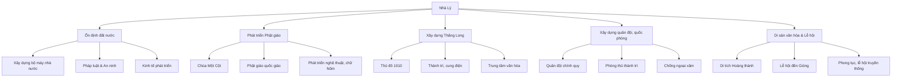

# Nhà Lý – Thời đại thịnh vượng và phát triển văn hóa

Nhà Lý (1009-1225) là một triều đại quan trọng trong lịch sử Việt Nam, đánh dấu kỷ nguyên thịnh vượng, ổn định và phát triển mạnh mẽ về mọi mặt, đặc biệt là văn hóa, quốc phòng, và tôn giáo. Đây là thời kỳ nền chính trị trung ương vững mạnh, quốc gia ổn định, văn hóa phát triển rực rỡ và thể chế nhà nước từng bước hoàn thiện.

---

## 1. Ổn định đất nước dưới triều đại nhà Lý

Nhà Lý kế thừa và phát huy sự nghiệp của nhà Tiền Lê, tập trung củng cố bộ máy nhà nước trung ương và địa phương. Một số thành tựu nổi bật gồm:

- **Xây dựng bộ máy quan lại chặt chẽ:** Nhà Lý tiếp tục hoàn thiện chế độ quan lại và cải cách hành chính theo thể chế phong kiến tập quyền, qua đó kiểm soát toàn diện lãnh thổ.
- **Pháp luật và an ninh:** Ban hành các luật lệ nhằm duy trì trật tự xã hội và bảo vệ quyền lợi nhân dân.
- **Kinh tế phát triển:** Tích cực phát triển nông nghiệp, thủ công nghiệp và thương mại. Nhân dân tập trung sản xuất, nhân khẩu tăng nhanh tạo nền tảng vững chắc cho đất nước.

---

## 2. Phát triển Phật giáo – tâm linh và văn hóa thời Lý

Phật giáo trở thành quốc giáo, gắn bó chặt chẽ với triều đình, vừa là tín ngưỡng giàu bản sắc, vừa góp phần ổn định xã hội và phát triển văn hóa.

- Nhà Lý rất chú trọng xây dựng các chùa chiền, tổ chức lễ nghi Phật giáo.
- **Chùa Một Cột** (hình ảnh biểu tượng văn hóa của Hà Nội ngày nay) là một trong những công trình nổi bật của thời Lý, vừa mang ý nghĩa tôn giáo vừa phản ánh tinh thần nghệ thuật đặc sắc.
- Phật giáo giúp khẳng định sự an lành, phồn thịnh của nhà nước, thúc đẩy văn hóa chữ Nôm và nghệ thuật điêu khắc, kiến trúc.

---

## 3. Xây dựng Thăng Long – Hà Nội, trung tâm hành chính và văn hóa

Dưới thời vua Lý Thái Tổ (1009 - 1028), Thăng Long được chọn làm thủ đô năm 1010, được xem là một bước ngoặt trong lịch sử đô thị Việt Nam.

- **Thăng Long** có vị trí địa lý thuận lợi, hội tụ đủ các yếu tố thiên thời, địa lợi, nhân hòa để phát triển.
- Thành phố được xây dựng quy mô, với hệ thống thành trì, cung điện, đền chùa, thể hiện quyền lực và sự văn minh.
- Việc chọn Thăng Long làm trung tâm đã góp phần định hình nền văn minh Việt Nam suốt nhiều thế kỷ tiếp theo.

---

## 4. Xây dựng quân đội và quốc phòng vững mạnh

Nhà Lý chú trọng xây dựng quân đội, củng cố quốc phòng nhằm bảo vệ độc lập, chủ quyền đất nước:

- **Quân đội chính quy được tổ chức theo hệ thống chặt chẽ, đào tạo bài bản.**
- Các chiến dịch bảo vệ biên giới phía Bắc chống quân Tống, xử lý các cuộc nổi loạn trong nước đều cho thấy hiệu quả của quân đội thời Lý.
- Hệ thống thành trì kiên cố quanh Thăng Long và các vùng chiến lược bảo vệ đất nước khỏi ngoại xâm.

---

## 5. Liên hệ di sản văn hóa Hà Nội và lễ hội truyền thống còn giữ đến ngày nay

Di sản nhà Lý vẫn còn dấu ấn rất đậm nét ở Hà Nội và nhiều vùng miền:

| Di sản/ Lễ hội | Mô tả - Ý nghĩa |
|-|-|
| **Chùa Một Cột** | Công trình kiến trúc độc đáo thời Lý còn nguyên vẹn, biểu tượng của Hà Nội. |
| **Lễ hội đền Gióng (Phù Đổng Thiên Vương)** | Lễ hội truyền thống liên quan tới câu chuyện vị anh hùng dân tộc thời Lý đánh giặc, thể hiện tinh thần yêu nước và truyền thống chống giặc ngoại xâm. |
| **Khu di tích Hoàng thành Thăng Long** | Gồm nhiều di tích thời Lý, Trần, Lê, là trung tâm chính trị xưa của đất nước, được UNESCO công nhận di sản thế giới. |
| **Các phong tục lễ hội truyền thống** như tế lễ trong chùa chiền, hội làng quanh Thăng Long và các vùng phụ cận vẫn được duy trì, phản ánh sự kế thừa di sản văn hóa thời Lý. |

---

# Tổng kết

Nhà Lý ghi dấu ấn sâu đậm trong lịch sử với:

- Quản lý và ổn định đất nước vững chắc,
- Mở rộng và phát triển Phật giáo, góp phần phong phú văn hóa tinh thần,
- Xây dựng Thăng Long làm kinh đô rực rỡ về chính trị, văn hóa,
- Củng cố quân đội, quốc phòng đảm bảo an ninh,
- Di sản văn hóa vật thể và phi vật thể vẫn còn ảnh hưởng sâu rộng đến Hà Nội đương đại và đời sống văn hóa Việt Nam.

Nhờ những thành tựu đó, nhà Lý được xem là triều đại mở ra thời kỳ phong kiến thịnh trị đầu tiên, tạo nền tảng cho sự phát triển tiếp theo của lịch sử Việt Nam.

---

# Sơ đồ tóm tắt nội dung

---

Nếu bạn cần một bài viết chi tiết hoặc kịch bản thuyết trình, tôi có thể giúp bạn soạn tiếp theo nhé!