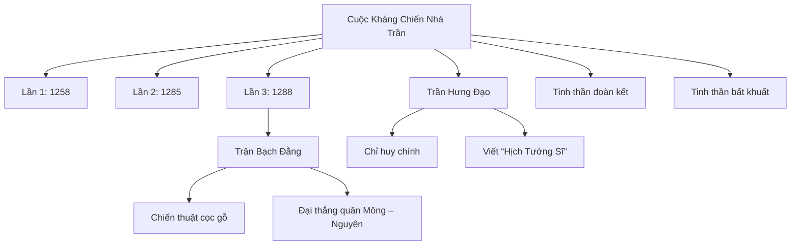

# Nhà Trần và Cuộc Kháng Chiến Chống Quân Mông – Nguyên Thế Kỷ 13

## Giới thiệu chung

Nhà Trần (1225 - 1400) là một triều đại phong kiến nổi bật trong lịch sử Việt Nam, nổi tiếng với tinh thần bất khuất và sự đoàn kết trong cuộc kháng chiến chống quân xâm lược Mông – Nguyên trong thế kỷ 13. Cuộc kháng chiến này gồm ba lần quân Mông – Nguyên tiến đánh Đại Việt (tiền thân của Việt Nam ngày nay) nhưng đều thất bại dưới sự chỉ huy tài tình của các vị tướng nhà Trần, đặc biệt là Trần Hưng Đạo.

---

## 1. Bối cảnh lịch sử và ý nghĩa cuộc kháng chiến

- **Thế kỷ 13**, đế chế Mông Cổ dưới sự lãnh đạo của Thành Cát Tư Hãn cùng đời con và cháu (Ô Mã Nhi, Hốt Tất Liệt) mở rộng bờ cõi, trong đó Đại Việt là một trong những quốc gia Đông Nam Á nằm trong tầm nhắm tấn công.
- Quân Mông – Nguyên với lực lượng hùng hậu và kỹ thuật chiến tranh vượt trội thời bấy giờ mong muốn chinh phục Đại Việt để tiến xuống các vùng phía Nam.
- Ba cuộc tấn công (năm 1258, 1285, 1288) đều bị nhà Trần đánh bại, bảo vệ thành công nền độc lập, chủ quyền và toàn vẹn lãnh thổ.

---

## 2. Ba cuộc kháng chiến chống quân Mông – Nguyên

| Lần tấn công | Năm      | Tình hình và diễn biến chính                           | Kết quả                          |
|--------------|----------|--------------------------------------------------------|---------------------------------|
| Lần 1        | 1258     | Quân Mông Cổ do Uriyangkhadai tấn công                 | Quân Trần phải lui về giữ giang sơn, dùng chính sách hòa hoãn và chiến tranh du kích |
| Lần 2        | 1285     | Quân Nguyên lần thứ hai tấn công với lực lượng lớn     | Quân Trần thắng trận trên nhiều mặt trận, quân Nguyên bị tiêu hao và phải rút lui |
| Lần 3        | 1288     | Cuộc tấn công cuối cùng do Toa Đô chỉ huy               | Đại thắng Trận Bạch Đằng: quân Mông – Nguyên đại bại, buộc phải rút lui hoàn toàn |

### Trận Bạch Đằng (1288)
- Đây là trận quyết định nổi tiếng nhất, quân Trần do **Trần Hưng Đạo** chỉ huy chủ lực, tận dụng triệt để địa hình sông nước.
- Dựng cọc gỗ ngầm dưới lòng sông Bạch Đằng, khi thủy triều rút, quân địch bị mắc kẹt và bị tấn công dữ dội.
- Đánh bại Toa Đô, một trong những chỉ huy quan trọng của quân Nguyên, qua đó chấm dứt hoàn toàn âm mưu đánh chiếm Đại Việt.

---

## 3. Vai trò của Trần Hưng Đạo và các nhân vật lịch sử nổi bật

### Trần Hưng Đạo (Trần Quốc Tuấn)
- Là người con cả của vua Trần Thái Tông.
- Chỉ huy tối cao và là danh tướng kiệt xuất trong ba cuộc kháng chiến.
- Sáng tạo chiến thuật chiến tranh phù hợp với điều kiện địa phương, biết khai thác thế mạnh thiên nhiên và ý chí kiên cường của dân tộc.
- Tác giả của cuốn binh thư **“Hịch Tướng Sĩ”**, kêu gọi tinh thần chiến đấu và đoàn kết của quân dân.

> **Trích đoạn “Hịch Tướng Sĩ”**:
> > “Ta thà làm con cọp dữ, không chịu làm con chó truỵ…”

### Các nhân vật khác
- **Trần Nhân Tông**: Vua nhà Trần, người đề cao việc giữ gìn quân binh và điều hành cuộc chiến.
- **Trần Nhật Duật**: Một tướng tài năng góp phần trong việc chỉ huy các trận đánh.
- **Trần Quang Khải**: Mạnh mẽ, phối hợp với Trần Hưng Đạo cực kỳ hiệu quả trong lãnh đạo quân đội.

---

## 4. Tinh thần bất khuất và sự đoàn kết dân tộc

### Tinh thần bất khuất
- Qua các trận đánh, tinh thần “**thà chết không chịu thần phục giặc**” được phát huy mãnh liệt.
- Quân dân Nhà Trần dù đối mặt với kẻ thù bách chiến bách thắng nhưng vẫn kiên cường giữ vững ý chí, lòng trung thành với đất nước.

### Sự đoàn kết dân tộc
- Quân đội gồm nông dân, tầng lớp binh sĩ và quân lính tinh nhuệ được huấn luyện nghiêm túc, đồng lòng vì mục đích chung.
- Chính sách quân dân thủ giúp tăng cường sức mạnh của lực lượng vũ trang.
- Quân dân hai miền đồng lòng chung tay bảo vệ non sông, đầy lòng yêu nước và niềm tin chiến thắng.

---

## 5. Liên hệ hiện đại: Bài học từ cuộc kháng chiến chống Mông – Nguyên

- **Tinh thần đoàn kết và bất khuất** vẫn luôn là bài học quý giá cho mỗi người dân Việt Nam.
- Trong bất kỳ hoàn cảnh nào, giữ vững bản sắc văn hóa, ý chí kiên cường là yếu tố quyết định sự bền vững của quốc gia.
- Tinh thần chống ngoại xâm, bảo vệ tổ quốc đã trở thành truyền thống quý báu cần được gìn giữ và phát huy trong mọi thời đại.

---

## Sơ đồ tóm tắt cuộc kháng chiến

---

# Tổng kết

Cuộc kháng chiến chống quân xâm lược Mông – Nguyên dưới thời Nhà Trần không chỉ bảo vệ được sự toàn vẹn lãnh thổ mà còn thể hiện tinh thần yêu nước và đoàn kết dân tộc mãnh liệt. Trần Hưng Đạo và các danh tướng Nhà Trần đã để lại dấu ấn lịch sử sâu sắc với tài cầm quân và lòng yêu nước nồng nàn. Tinh thần “thà chết không khuất phục” và sự đồng lòng của toàn dân vẫn là bài học quý giá, truyền cảm hứng trong công cuộc bảo vệ và xây dựng đất nước hôm nay.

---

**Nguồn tham khảo:**

- “Đại Việt Sử Ký Toàn Thư”
- “Hịch Tướng Sĩ” – Trần Hưng Đạo
- Các nghiên cứu lịch sử về Nhà Trần và các cuộc kháng chiến Mông – Nguyên

---

Nếu bạn cần một bài viết ngắn gọn hay mở rộng thêm phần nào, hãy cho tôi biết!