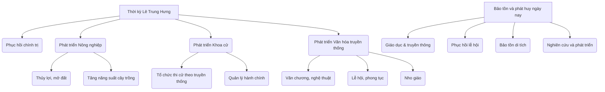

# Nghiên cứu thời kỳ phục hồi và phát triển của nhà Lê Trung Hưng và sự phát triển văn hóa, xã hội

## Giới thiệu chung về thời kỳ Lê Trung Hưng

Thời kỳ Lê Trung Hưng (từ đầu thế kỷ 17 đến cuối thế kỷ 18) là giai đoạn lịch sử quan trọng trong lịch sử Việt Nam, đánh dấu sự phục hồi quyền lực của triều đại nhà Lê sau những biến động chính trị kéo dài. Đây là thời kỳ mà nhà Lê dần lấy lại thế chủ đạo, đồng thời tạo nên nhiều bước tiến trên các lĩnh vực văn hóa, xã hội và kinh tế, đặc biệt là nông nghiệp, khoa cử và phát triển các giá trị văn hóa truyền thống.

---

## 1. Bối cảnh phục hồi và phát triển của nhà Lê Trung Hưng

- Sau sự suy yếu của nhà Lê đầu thế kỷ 17 và sự chiếm đóng của quân Trịnh – Nguyễn phân tranh, triều đình nhà Lê phục hồi thế lực dưới sự trợ giúp của chúa Trịnh.
-Thời kỳ này diễn ra từ triều vua Lê Thần Tông (1600 - 1619) đến vua Lê Chiêu Thống (1787-1788).
- Sự phục hồi của nhà Lê thể hiện qua việc củng cố nền chính trị, ổn định xã hội và phát triển kinh tế – văn hóa.

---

## 2. Phát triển nông nghiệp

### a. Nông nghiệp được chú trọng phát triển

- Nông nghiệp là nền tảng kinh tế chính, giúp duy trì sự ổn định xã hội.
- Trong thời kỳ Lê Trung Hưng, nhà nước chú trọng đầu tư làm thủy lợi, khai hoang đất đai hoang hóa để tăng diện tích canh tác.
- Sử dụng hệ thống đê điều phòng chống lụt lội, bảo vệ mùa màng, đặc biệt ở đồng bằng sông Hồng.

### b. Ví dụ cụ thể

- Việc cải tiến kỹ thuật thâm canh và kỹ thuật gieo trồng đã làm tăng năng suất lúa.
- Mở rộng các vùng canh tác: Khu vực Thanh Hóa, Nghệ An và đồng bằng Bắc Bộ đa dạng hóa loại cây trồng.
- "Cống nạp" từ nông dân được đánh giá cao hơn, tạo điều kiện cho kinh tế phát triển.

---

## 3. Phát triển khoa cử

Khoa cử là con đường quan trọng để tuyển chọn nhân tài giúp triều đình quản lý đất nước.

### a. Quá trình khoa cử thời Lê Trung Hưng

- Khoa cử duy trì tổ chức hàng năm với các kỳ thi Hương, thi Hội, thi Đình.
- Các nhà Nho tiếp tục được trọng dụng, sử dụng như các quan lại quản lý hành chính và giáo dục.
  
### b. Ý nghĩa

- Khoa cử giúp duy trì mạng lưới quan lại có trình độ học vấn, làm nền tảng cho hệ thống chính trị ổn định.
- Duy trì và phát triển hệ tư tưởng Nho giáo, giúp củng cố nền tảng thế hệ trí thức và văn hóa trí thức.

---

## 4. Phát triển văn hóa truyền thống

### a. Sự phát triển của văn chương, nghệ thuật

- Văn chương thời Lê Trung Hưng tiếp tục phát triển, nhiều tác phẩm văn học chữ Hán và chữ Nôm được sáng tác, phản ánh đời sống xã hội và tâm linh dân tộc.
- Thơ ca, văn học sử thi, ca dao tục ngữ phát triển mạnh mẽ cũng như các loại hình nghệ thuật truyền thống như múa rối nước, hát chèo.

### b. Bảo tồn và phát huy các giá trị truyền thống

- Các lễ hội dân gian, phong tục tập quán được duy trì rộng rãi.
- Các công trình đền chùa, văn miếu được trùng tu, xây dựng.
- Nho giáo là nền tảng cho việc giáo dục đạo đức xã hội và lễ nghi.

---

## 5. Liên hệ việc bảo tồn và phát huy giá trị văn hóa Việt Nam hiện nay

### a. Tầm quan trọng của việc bảo tồn văn hóa truyền thống

- Văn hóa truyền thống như Nho giáo, các làn điệu dân ca, phong tục lễ hội là nền tảng giúp định hình bản sắc dân tộc Việt Nam.
- Giúp kết nối giữa quá khứ và hiện tại, tạo nên sự đa dạng văn hóa.

### b. Thực trạng hiện nay

- Toàn cầu hóa và hiện đại hóa gây nên sự mai một một số giá trị văn hóa truyền thống.
- Nhiều lễ hội, phong tục bị lãng quên hoặc biến dạng.

### c. Giải pháp bảo tồn và phát huy

|Giải pháp|Mô tả|
|-|-|
|Giáo dục và tuyên truyền| Lồng ghép giáo dục văn hóa truyền thống vào chương trình học, tổ chức các chương trình truyền thông|
|Phục dựng và phát triển lễ hội| Tổ chức lại các lễ hội truyền thống, du lịch văn hóa kết hợp bảo vệ di sản|
|Bảo tồn di tích lịch sử| Tu bổ, giữ gìn các di tích thời Lê Trung Hưng, văn miếu, đình chùa|
|Khuyến khích nghiên cứu văn hóa| Tạo điều kiện cho các nghiên cứu khoa học về văn hóa truyền thống|

---

## 6. Sơ đồ tóm tắt

---

## Kết luận

Thời kỳ nhà Lê Trung Hưng là giai đoạn phục hồi và phát triển quan trọng của lịch sử Việt Nam, với các bước tiến rõ nét trong nông nghiệp, khoa cử và văn hóa truyền thống. Những giá trị văn hóa và xã hội được hình thành trong thời kỳ này vẫn còn ảnh hưởng mạnh mẽ tới ngày nay. Việc bảo tồn và phát huy các giá trị đó là nhiệm vụ quan trọng để giữ gìn bản sắc dân tộc và phát triển đất nước trong bối cảnh hiện đại.

---

Nếu bạn cần, tôi có thể giúp thêm các ví dụ về tác phẩm văn học, các lễ hội cụ thể thời Lê Trung Hưng hoặc tư liệu nghiên cứu chi tiết hơn!