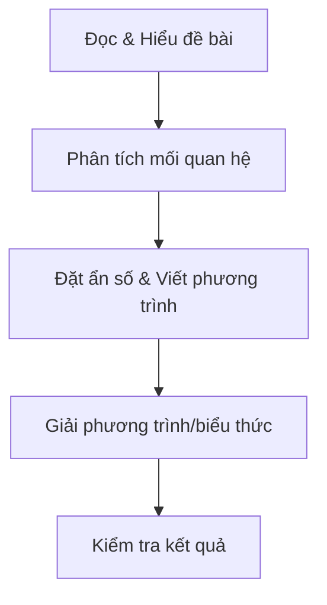

# Phương pháp tìm số trong toán học: Tập trung vào bài toán tìm số đơn giản và nâng cao

Trong toán học, **tìm số** là một dạng bài toán rất phổ biến và quan trọng, giúp rèn luyện tư duy logic, khả năng phân tích và vận dụng kiến thức để giải quyết các bài toán thực tế. Bài viết này sẽ tập trung vào các dạng bài toán tìm số phổ biến như:

- Tìm số hạng trong dãy số
- Tìm số chưa biết trong phép tính
- Tìm số nguyên thỏa mãn điều kiện cho trước

Đồng thời hướng dẫn chi tiết các bước phân tích và giải bài toán, kèm ví dụ minh họa cụ thể và code mẫu nếu cần thiết.

---

## 1. Các dạng bài toán tìm số phổ biến

### 1.1 Tìm số hạng trong dãy số
- **Ý nghĩa**: Cho một dãy số hoặc quy luật của dãy số, cần tìm một số hạng chưa biết nằm ở vị trí xác định.
- Ví dụ: Dãy số 2, 5, 8, 11, ... Tìm số hạng thứ 10.

### 1.2 Tìm số chưa biết trong phép tính
- **Ý nghĩa**: Bài toán cho một phép tính chứa một hoặc nhiều số chưa biết, yêu cầu tìm giá trị số phù hợp.
- Ví dụ: Tìm số x biết \(x + 7 = 15\).

### 1.3 Tìm số nguyên thỏa mãn điều kiện cho trước
- **Ý nghĩa**: Cho một điều kiện, yêu cầu tìm số nguyên thỏa mãn điều kiện đó.
- Ví dụ: Tìm số nguyên n sao cho \(2n + 3 < 15\).

---

## 2. Hướng dẫn các bước phân tích và giải bài toán tìm số

Dù bài toán tìm số có dạng khác nhau, ta có thể áp dụng các bước chung sau:

### Bước 1: Đọc và hiểu đề bài
- Xác định rõ yêu cầu tìm gì: số hạng thứ mấy, số chưa biết trong biểu thức, hay số nguyên thỏa mãn điều kiện.
- Xác định các dữ kiện đã cho.

### Bước 2: Phân tích bài toán
- Tìm mối quan hệ giữa các phần tử trong dãy số hoặc các đại lượng trong phép tính.
- Đặt ẩn số (nếu chưa có).
- Viết phương trình hoặc biểu thức thể hiện mối quan hệ đó.

### Bước 3: Giải phương trình/biểu thức
- Giải tìm ẩn số theo các quy tắc toán học.
- Đối với bài toán tìm số hạng trong dãy số, sử dụng công thức tổng quát của dãy (cấp số cộng, cấp số nhân,...).

### Bước 4: Kiểm tra lại kết quả
- Thay kết quả vào bài toán gốc để kiểm tra tính đúng đắn.
- Đảm bảo kết quả thỏa mãn mọi điều kiện đề bài.

---

## 3. Ví dụ minh họa cụ thể

### Ví dụ 1: Tìm số hạng trong dãy số cấp số cộng

> Cho dãy số sau: 3, 7, 11, 15, ...  
> Tìm số hạng thứ 20.

**Bước 1:** Dãy số trên là cấp số cộng với số hạng đầu \(a_1 = 3\), công sai \(d = 4\).

**Bước 2:** Công thức số hạng tổng quát của cấp số cộng là:  
\[
a_n = a_1 + (n-1)d
\]

**Bước 3:** Thay \(n=20\) vào công thức:  
\[
a_{20} = 3 + (20-1)*4 = 3 + 19*4 = 3 + 76 = 79
\]

**Bước 4:** Kết quả đã hợp lý.

---

### Ví dụ 2: Tìm số chưa biết trong phép tính đơn giản

> Tìm số \(x\) biết:  
> \[
> 5x - 2 = 3x + 14
> \]

**Giải:**  
\[
5x - 2 = 3x + 14 \implies 5x - 3x = 14 + 2 \implies 2x = 16 \implies x = 8
\]

---

### Ví dụ 3: Tìm số nguyên thỏa mãn điều kiện

> Tìm số nguyên \(n\) sao cho:  
> \[
> 3n - 5 < 10
> \]

**Giải:**  
\[
3n - 5 < 10 \Rightarrow 3n < 15 \Rightarrow n < 5
\]

Vì \(n\) là số nguyên nên:  
\[
n = ..., -1, 0, 1, 2, 3, 4
\]

---

## 4. Code mẫu: Tìm số hạng thứ \(n\) trong dãy số cấp số cộng

Dưới đây là ví dụ code Python giúp tính số hạng thứ \(n\):

```python
def so_hang_cap_so_cong(a1, d, n):
    """
    Hàm tính số hạng thứ n trong dãy cấp số cộng có số hạng đầu a1 và công sai d.
    """
    return a1 + (n - 1) * d

# Ví dụ tính số hạng thứ 20 trong dãy 3, 7, 11 ...
a1 = 3
d = 4
n = 20

result = so_hang_cap_so_cong(a1, d, n)
print(f"Số hạng thứ {n} là: {result}")
```

**Output:**  
```
Số hạng thứ 20 là: 79
```

---

## 5. Diagram: Các bước giải bài toán tìm số



---

## 6. Lời kết

Phương pháp tìm số trong toán học đòi hỏi sự nhạy bén và tư duy phân tích. Việc luyện tập các dạng bài toán từ đơn giản đến phức tạp sẽ giúp bạn nâng cao khả năng giải quyết vấn đề hiệu quả. Hãy thành thạo các bước phân tích, đặt ẩn số, viết phương trình và kiểm tra kết quả để làm chủ bài toán tìm số ở mọi cấp độ!

Nếu bạn cần thêm ví dụ hay bài tập cụ thể, đừng ngần ngại yêu cầu nhé!