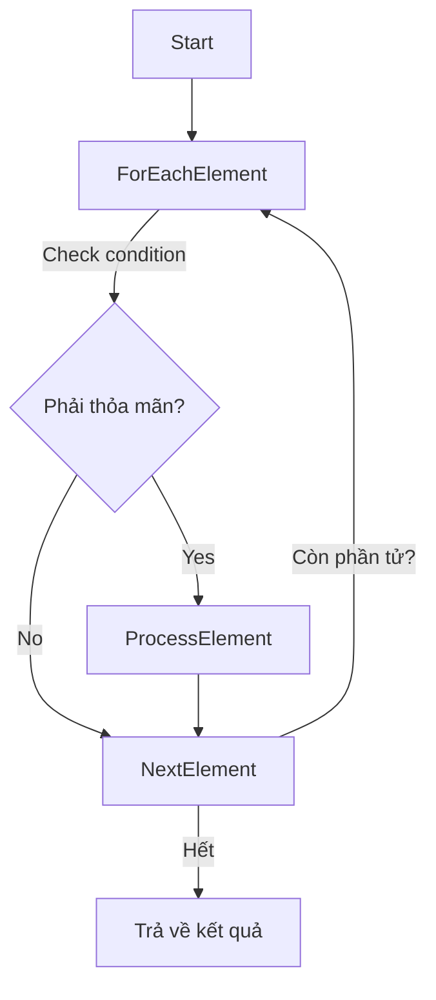

# Phương pháp tìm phần tử trong tập hợp dựa trên tính chất đặc trưng hoặc điều kiện đã cho

Trong toán học và lập trình, việc tìm phần tử trong tập hợp dựa trên các tính chất đặc trưng hoặc điều kiện cụ thể là một kỹ năng rất quan trọng. Các bài toán phổ biến có thể yêu cầu tìm:  
- Phần tử lớn nhất hoặc nhỏ nhất trong tập hợp  
- Phần tử đầu tiên thỏa mãn một điều kiện nhất định  
- Tập hợp các phần tử thỏa mãn điều kiện cho trước  

Bài viết này sẽ giúp bạn **khám phá cách tìm phần tử trong tập hợp dựa trên tính chất hoặc điều kiện** dưới góc nhìn cả lý thuyết và thực hành.  

---

## 1. Khái niệm cơ bản về tập hợp

- **Tập hợp** là một tập các phần tử (có thể là số, đối tượng, chuỗi, v.v.) phân biệt nhau.  
- Ví dụ:  
  \[
  A = \{3, 5, 7, 2, 9, 1\}
  \]
- Mỗi phần tử có thể được đặc trưng qua **điều kiện** hoặc một đặc tính nào đó.  

---

## 2. Các phương pháp tìm phần tử trong tập hợp

### 2.1 Tìm phần tử lớn nhất / nhỏ nhất

Phần tử lớn nhất (max) hoặc nhỏ nhất (min) là phần tử có giá trị lớn nhất, nhỏ nhất theo một tiêu chí cụ thể.

- **Ý tưởng chung**: Duyệt qua tất cả các phần tử và cập nhật giá trị lớn nhất hoặc nhỏ nhất tìm được.  
- **Ví dụ**: Tìm phần tử lớn nhất trong tập hợp \( A = \{3, 5, 7, 2, 9, 1\} \).

### Thuật toán:
1. Khởi tạo biến `max_value` = phần tử đầu tiên trong tập hợp.  
2. Duyệt lần lượt từng phần tử trong tập hợp:  
   - Nếu phần tử hiện tại > `max_value` thì cập nhật `max_value`.  
3. Sau khi duyệt xong, `max_value` chính là phần tử lớn nhất.  

---

### Ví dụ bằng Python:

```python
A = [3, 5, 7, 2, 9, 1]

def find_max_element(arr):
    max_value = arr[0]
    for num in arr:
        if num > max_value:
            max_value = num
    return max_value

print("Phần tử lớn nhất trong tập hợp là:", find_max_element(A))
```

**Output:**  
```
Phần tử lớn nhất trong tập hợp là: 9
```

---

### 2.2 Tìm phần tử thỏa mãn điều kiện cho trước

Đây là kỹ thuật tìm phần tử hoặc tập hợp các phần tử thỏa mãn điều kiện đặc biệt.

- Ví dụ: Tìm phần tử chẵn đầu tiên trong tập hợp \( A = \{3, 5, 7, 2, 9, 1\} \).  

### Thuật toán:
1. Duyệt qua từng phần tử.  
2. Kiểm tra điều kiện (ví dụ: số chẵn là `num % 2 == 0`).  
3. Khi tìm thấy phần tử thỏa mãn, dừng và trả về kết quả.  

---

### Ví dụ bằng Python:

```python
def find_first_even(arr):
    for num in arr:
        if num % 2 == 0:
            return num
    return None  # không tìm thấy phần tử thỏa mãn

print("Phần tử chẵn đầu tiên là:", find_first_even(A))
```

**Output:**  
```
Phần tử chẵn đầu tiên là: 2
```

---

### 2.3 Tìm tập hợp các phần tử thỏa mãn điều kiện

Đôi khi ta muốn tìm tất cả phần tử trong tập hợp thỏa mãn điều kiện cho trước.

- Ví dụ: Tìm tất cả số nguyên tố trong tập hợp \( A = \{3, 5, 7, 2, 9, 1\} \).

---

### Kiểm tra số nguyên tố (hàm hỗ trợ):

```python
def is_prime(n):
    if n < 2:
        return False
    for i in range(2, int(n ** 0.5) + 1):
        if n % i == 0:
            return False
    return True
```

---

### Tìm tất cả số nguyên tố trong tập hợp:

```python
def find_all_primes(arr):
    primes = []
    for num in arr:
        if is_prime(num):
            primes.append(num)
    return primes

print("Các số nguyên tố trong tập hợp:", find_all_primes(A))
```

**Output:**  
```
Các số nguyên tố trong tập hợp: [3, 5, 7, 2]
```

---

## 3. Minh họa bằng Diagram



---

## 4. Tổng kết

- **Tìm phần tử lớn nhất / nhỏ nhất:** duyệt qua tất cả phần tử, cập nhật giá trị max/min.  
- **Tìm phần tử thỏa mãn điều kiện:** duyệt qua danh sách và kiểm tra từng phần tử với điều kiện cho trước.  
- **Tìm tất cả phần tử thỏa mãn điều kiện:** dùng list (hoặc tập hợp) phụ lưu trữ những phần tử thỏa mãn.  

Bạn có thể áp dụng các phương pháp này cho mọi loại tập hợp, từ số nguyên, số thực, đến tập hợp các đối tượng phức tạp hơn với các điều kiện tùy chỉnh.

---

## 5. Bài tập gợi ý

- Viết hàm tìm phần tử nhỏ nhất trong một danh sách số thực có thể âm, dương.  
- Tìm phần tử có chữ cái đầu tiên trong danh sách chuỗi thoả mãn điều kiện bắt đầu bằng "A".  
- Tìm tất cả các số chính phương trong danh sách số nguyên.  

---

Nếu bạn muốn, tôi có thể cung cấp thêm ví dụ nâng cao hoặc mở rộng phương pháp cho các tập hợp phức tạp hơn!