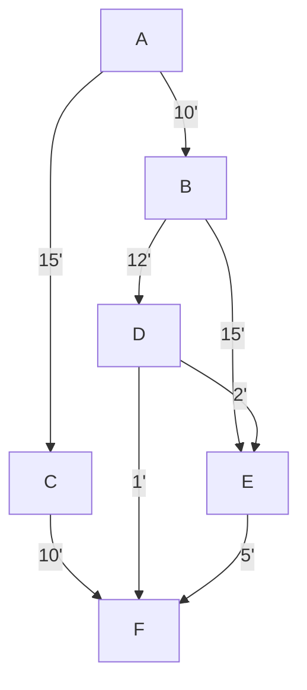

# Ứng dụng phương pháp tìm trong giải các bài toán thực tế

Phương pháp tìm là một trong những kỹ thuật quan trọng trong toán học và lập trình, giúp chúng ta giải quyết các bài toán thực tế như tìm điểm cao nhất, thời gian ngắn nhất hay chi phí tối ưu. Việc thực hành áp dụng các phương pháp tìm không những nâng cao kỹ năng tư duy logic mà còn giúp vận dụng kiến thức một cách hiệu quả vào thực tế.

---

## 1. Tổng quan về phương pháp tìm

Phương pháp tìm là quy trình **tìm kiếm** một giá trị thỏa mãn yêu cầu đề bài trong một tập hợp các giá trị, có thể là tìm **tối đa/tối thiểu**, tìm giá trị phù hợp nhất hoặc tìm điểm đáp ứng điều kiện cụ thể.

### Một số phương pháp tìm phổ biến
- **Tìm kiếm tuần tự (Linear Search):** Duyệt lần lượt từng phần tử.
- **Tìm kiếm nhị phân (Binary Search):** Áp dụng với dữ liệu đã sắp xếp, giảm bớt số bước kiểm tra.
- **Tìm kiếm tối ưu (Optimization Search):** Sử dụng các thuật toán như tìm cực trị trong hàm số, tìm đường đi ngắn nhất, lập trình tuyến tính.

---

## 2. Thực hành áp dụng phương pháp tìm trong bài toán thực tế

### A. Tìm điểm cao nhất - Bài toán tối đa hóa

**Ví dụ:** Cho một dãy số biểu diễn độ cao của các điểm trên một con đường, hãy tìm điểm có độ cao lớn nhất.

```python
heights = [120, 135, 150, 148, 170, 160, 155]

def find_max_height(points):
    max_height = points[0]
    max_index = 0
    for i in range(1, len(points)):
        if points[i] > max_height:
            max_height = points[i]
            max_index = i
    return max_index, max_height

idx, height = find_max_height(heights)
print(f"Điểm cao nhất tại vị trí {idx} với độ cao {height} mét.")
```

**Giải thích:** Ta thực hiện tìm kiếm tuyến tính để xác định phần tử lớn nhất và vị trí tương ứng.

---

### B. Tìm thời gian ngắn nhất - Bài toán tìm đường đi

**Ví dụ:** Trong hệ thống giao thông, cần tìm đường đi ngắn nhất từ điểm A đến điểm B.

**Phương pháp:** Sử dụng thuật toán **Dijkstra** để tìm đường đi có tổng thời gian ngắn nhất.

```python
import heapq

def dijkstra(graph, start, end):
    heap = [(0, start)]
    visited = set()
    distance = {node: float('inf') for node in graph}
    distance[start] = 0
    
    while heap:
        current_dist, current_node = heapq.heappop(heap)
        if current_node == end:
            return current_dist
        
        if current_node in visited:
            continue
        
        visited.add(current_node)
        
        for neighbor, time in graph[current_node].items():
            new_dist = current_dist + time
            if new_dist < distance[neighbor]:
                distance[neighbor] = new_dist
                heapq.heappush(heap, (new_dist, neighbor))
    return float('inf')

# Đồ thị mô tả thời gian (phút) giữa các điểm
graph = {
    'A': {'B': 10, 'C': 15},
    'B': {'D': 12, 'E': 15},
    'C': {'F': 10},
    'D': {'E': 2, 'F': 1},
    'E': {'F': 5},
    'F': {}
}

shortest_time = dijkstra(graph, 'A', 'F')
print(f"Thời gian ngắn nhất từ A đến F là {shortest_time} phút.")
```

**Giải thích:** Thuật toán Dijkstra duy trì một hàng đợi ưu tiên dựa trên thời gian tích lũy, cập nhật con đường ngắn nhất đến các điểm trên đồ thị.

---

### C. Tìm chi phí tối ưu - Bài toán tối ưu hóa chi phí

**Ví dụ:** Một công ty muốn tối ưu chi phí vận chuyển hàng hóa giữa các kho và các điểm tiêu thụ sao cho chi phí tổng là nhỏ nhất.

**Phương pháp:** Áp dụng **Lập trình tuyến tính** hoặc thuật toán **Hungarian** đối với bài toán phân bổ.

----

## 3. Tóm tắt lợi ích của việc ứng dụng phương pháp tìm

- **Phát triển tư duy logic:** Việc xác định và lựa chọn thuật toán tìm phù hợp giúp người học rèn luyện kỹ năng suy luận.
- **Vận dụng kiến thức thực tế:** Qua các bài toán thực tế, kiến thức học được không còn là lý thuyết mà trở thành công cụ giải quyết vấn đề.
- **Tiết kiệm thời gian và tài nguyên:** Giúp tìm ra phương án tối ưu nhanh chóng, hiệu quả.

---

## 4. Kết luận

Việc thực hành áp dụng các phương pháp tìm trong giải các bài toán thực tế là bước quan trọng để nâng cao kỹ năng tư duy logic cũng như khả năng vận dụng kiến thức. Từ việc tìm điểm cao nhất, thời gian ngắn nhất đến chi phí tối ưu, các phương pháp tìm kiếm đã trở thành công cụ đắc lực, hỗ trợ đắc lực trong mọi lĩnh vực.

Bạn đọc nên tích cực luyện tập các bài toán điển hình và mở rộng hiểu biết về thuật toán nhằm nâng cao kỹ năng cũng như hiệu quả trong công việc thực tế.

---

# Diagram minh họa phương pháp tìm trong bài toán thời gian ngắn nhất (Dijkstra):



---

Nếu bạn muốn mình hỗ trợ thêm các ví dụ hay bài tập cụ thể, bạn cứ yêu cầu nhé!