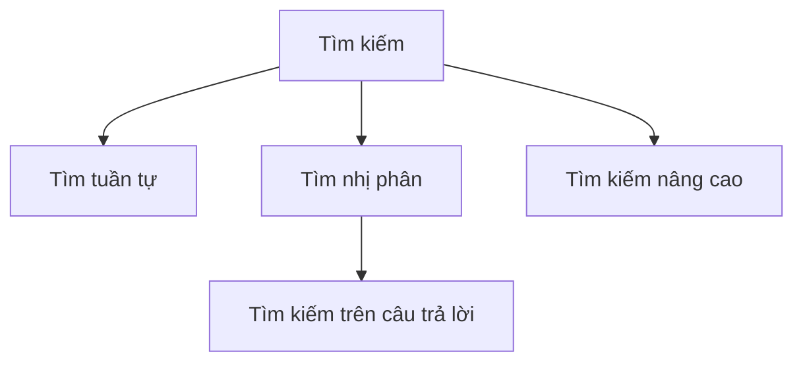

# Tổng kết và luyện tập chủ đề "Tìm" – Ôn tập toàn bộ kiến thức về các phương pháp tìm

---

## 1. Giới thiệu chung

Chủ đề **"Tìm"** trong toán học và lập trình thường liên quan tới việc tìm ra giá trị, vị trí, hay tập con phù hợp trong một tập dữ liệu dựa trên các điều kiện nhất định. Việc nắm vững các phương pháp tìm sẽ giúp bạn giải quyết nhanh chóng và chính xác các bài toán trong nhiều lĩnh vực như thuật toán, cơ sở dữ liệu, cấu trúc dữ liệu,...

---

## 2. Các phương pháp tìm cơ bản

### 2.1. Tìm tuần tự (Linear Search)

- **Ý tưởng**: Duyệt từng phần tử từ đầu đến cuối để kiểm tra điều kiện cần tìm.
- **Độ phức tạp**: O(n), với n là số phần tử.

#### Ví dụ: Tìm số x trong mảng arr

```python
def linear_search(arr, x):
    for i, val in enumerate(arr):
        if val == x:
            return i  # Trả về vị trí tìm thấy
    return -1  # Không tìm thấy
```

---

### 2.2. Tìm nhị phân (Binary Search)

- **Điều kiện áp dụng**: Mảng đã được sắp xếp.
- **Ý tưởng**: Mỗi lần so sánh, loại bỏ một nửa phần tử còn lại.
- **Độ phức tạp**: O(log n).

#### Ví dụ: Tìm số x trong mảng đã sắp xếp arr

```python
def binary_search(arr, x):
    left, right = 0, len(arr) - 1
    while left <= right:
        mid = (left + right) // 2
        if arr[mid] == x:
            return mid
        elif arr[mid] < x:
            left = mid + 1
        else:
            right = mid -1
    return -1
```

---

### 2.3. Tìm kiếm nâng cao

- **Tìm kiếm theo điều kiện phức tạp** (ví dụ: tìm phần tử thoả mãn điều kiện với nhiều biến số)
- **Tìm kiếm trên cấu trúc dữ liệu nâng cao**: cây, đồ thị, bảng băm,...
- **Tìm kiếm nhị phân trên câu trả lời**: dùng khi bài toán yêu cầu tìm giá trị tối ưu thỏa mãn điều kiện.

Ví dụ: Tìm giá trị lớn nhất nhỏ hơn hoặc bằng X thỏa mãn điều kiện trên dãy.

---

## 3. Tổng hợp bài tập luyện tập

Dưới đây là các bài tập giúp bạn ôn lại kiến thức.

### Bài tập 1: Tìm vị trí đầu tiên giá trị x trong mảng

**Đề bài**: Cho mảng arr = [3,5,7,7,8,9], tìm vị trí đầu tiên của phần tử 7.

**Hướng giải quyết**: Dùng tìm tuần tự hoặc tìm nhị phân.

```python
def first_occurrence(arr, x):
    left, right = 0, len(arr) - 1
    result = -1
    while left <= right:
        mid = (left + right) // 2
        if arr[mid] == x:
            result = mid
            right = mid - 1  # tiếp tục tìm bên trái
        elif arr[mid] < x:
            left = mid + 1
        else:
            right = mid - 1
    return result
```

---

### Bài tập 2: Tìm giá trị nhỏ nhất thỏa mãn điều kiện

**Đề bài**: Cho mảng arr tăng dần, tìm giá trị nhỏ nhất >= X.

**Giải pháp**: Sử dụng tìm kiếm nhị phân để tìm ranh giới (lower bound).

```python
def lower_bound(arr, x):
    left, right = 0, len(arr)
    while left < right:
        mid = (left + right) // 2
        if arr[mid] < x:
            left = mid + 1
        else:
            right = mid
    if left < len(arr):
        return arr[left]
    else:
        return None  # Không thỏa mãn
```

---

### Bài tập 3: Tìm trên câu trả lời (Binary Search on Answer)

**Đề bài**: Cho dãy số, tìm giá trị lớn nhất K sao cho tồn tại một đoạn con có tổng >= K.

**Ý tưởng**: Dùng kiểm tra đoạn con bằng thuật toán kiểm tra (chi tiết trong thực hành).

---

## 4. Phân tích và rút kinh nghiệm

| Phương pháp   | Ưu điểm                   | Nhược điểm                     | Lưu ý                          |
|---------------|---------------------------|--------------------------------|-------------------------------|
| Tìm tuần tự   | Đơn giản, không cần sắp xếp| Chậm khi mảng lớn              | Dùng khi số phần tử nhỏ       |
| Tìm nhị phân  | Nhanh, hiệu quả (log n)   | Cần mảng đã sắp xếp            | Hiểu rõ cách cài đặt tránh bug |
| Tìm kiếm nâng cao| Giải quyết bài toán phức tạp| Cần hiểu sâu thuật toán, cấu trúc dữ liệu | Thường dùng kết hợp nhiều kỹ thuật |

- **Các lỗi thường gặp**: lặp vô hạn, cập nhật sai biến hai đầu, không xử lý trường hợp không tìm thấy.
- **Kinh nghiệm**: luôn kiểm tra kỹ điều kiện dừng vòng lặp, thử các trường hợp biên, viết code sạch, comments rõ ràng.

---

## 5. Sơ đồ tổng quan các phương pháp tìm



---

## 6. Kết luận

Để thành thạo kỹ năng "Tìm" trong bài toán:

- Hiểu rõ bản chất và điều kiện áp dụng các phương pháp.
- Luyện tập đa dạng bài tập, bao gồm dùng thuật toán cơ bản và kết hợp trong bài toán thực tế.
- Phân tích, rút kinh nghiệm để tránh sai sót trong quá trình cài đặt.
- Biết khi nào áp dụng phương pháp nào để tối ưu hiệu quả và độ phức tạp.

---

Nếu bạn cần, tôi có thể cung cấp thêm các bài tập nâng cao hoặc minh họa giải pháp từng bước. Bạn có muốn không?