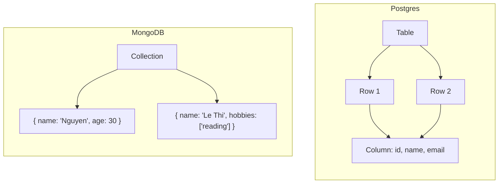

# Phân tích chi tiết về mô hình dữ liệu và tính nhất quán: So sánh Postgres và MongoDB

Trong thế giới cơ sở dữ liệu hiện đại, việc lựa chọn mô hình dữ liệu và cơ chế nhất quán phù hợp đóng vai trò rất quan trọng để đáp ứng các yêu cầu về hiệu suất, tính mở rộng và độ tin cậy của ứng dụng. Bài viết này sẽ tập trung phân tích chi tiết **Postgres** và **MongoDB** — hai hệ quản trị cơ sở dữ liệu nổi bật với sự khác biệt rõ ràng về mô hình dữ liệu cũng như cơ chế đảm bảo tính nhất quán.  

---

## 1. Mô hình dữ liệu

### 1.1. Postgres: Bảng – Hàng – Cột với schema cứng (schema-on-write)

Postgres là hệ quản trị cơ sở dữ liệu quan hệ (Relational Database Management System - RDBMS) sử dụng bảng (table), hàng (row), cột (column) và một schema **cứng** được định nghĩa chặt chẽ trước khi lưu dữ liệu.  

- **Schema-on-write**: Dữ liệu phải tuân theo schema trước khi được ghi vào cơ sở dữ liệu. Nếu dữ liệu không hợp lệ hoặc không tương thích, thao tác ghi sẽ bị từ chối.  
- **Ví dụ về tạo bảng và inserts dữ liệu:**

```sql
CREATE TABLE users (
    id SERIAL PRIMARY KEY,
    name VARCHAR(100) NOT NULL,
    email VARCHAR(100) UNIQUE NOT NULL,
    age INT CHECK (age >= 0)
);

INSERT INTO users (name, email, age) VALUES ('Nguyen Van A', 'a@example.com', 30);
```

Schema này xác định cấu trúc rõ ràng: mỗi bản ghi (row) trong bảng `users` phải có `name`, `email` và `age` với kiểu phù hợp.  

- **Ưu điểm**

  - Dữ liệu có cấu trúc nghiêm ngặt, dễ kiểm soát và tránh sai sót (như dữ liệu không hợp lệ).  
  - Hỗ trợ truy vấn mạnh mẽ với SQL.  
  - Tương thích tốt với các ứng dụng đòi hỏi tính toàn vẹn dữ liệu cao.  

- **Nhược điểm**

  - Không linh hoạt với các dữ liệu thay đổi nhanh về cấu trúc.  
  - Cần sửa đổi schema để mở rộng hoặc thay đổi cấu trúc dữ liệu, có thể gây gián đoạn.  

---

### 1.2. MongoDB: Document JSON-like với schema linh hoạt (schema-on-read)

MongoDB là hệ quản trị cơ sở dữ liệu NoSQL dạng tài liệu (Document-Oriented Database), dữ liệu lưu trữ dưới dạng các **document JSON-like (BSON)**.  

- **Schema-on-read** (hoặc schema linh hoạt): Dữ liệu khi ghi không bắt buộc phải theo một schema cứng nhắc. Reader sẽ quyết định cách hiểu dữ liệu tại thời điểm truy vấn.  
- Ví dụ về insert document:

```javascript
db.users.insertOne({
  name: "Nguyen Van B",
  email: "b@example.com",
  age: 25,
  address: { city: "Hanoi", district: "Ba Dinh" }
});
```

- Một document khác có thể không chứa trường `age` hoặc có thêm trường mới:

```javascript
db.users.insertOne({
  name: "Le Thi C",
  email: "c@example.com",
  hobbies: ["reading", "traveling"]
});
```

- **Ưu điểm**

  - Rất linh hoạt, dễ mở rộng dữ liệu mà không cần thay đổi cấu trúc toàn bộ database.  
  - Phù hợp với các ứng dụng dữ liệu đa dạng, không đồng nhất.  
  - Dễ phát triển nhanh và thay đổi mô hình dữ liệu.  

- **Nhược điểm**

  - Khó kiểm soát toàn vẹn dữ liệu nếu không có cơ chế kiểm tra schema do MongoDB không bắt buộc.  
  - Truy vấn đa dạng và phức tạp có thể khó tối ưu hơn so với SQL chuẩn.  

---

## 2. Tính nhất quán của dữ liệu: ACID vs BASE

### 2.1. Postgres và mô hình ACID

Postgres tuân thủ các nguyên lý **ACID** để đảm bảo tính nhất quán dữ liệu:  

- **Atomicity (Tính nguyên tử):** Một giao dịch (transaction) được thực hiện toàn bộ hoặc không thực hiện gì cả.  
- **Consistency (Tính nhất quán):** Giao dịch chỉ đưa dữ liệu từ trạng thái hợp lệ này sang trạng thái hợp lệ khác.  
- **Isolation (Tính cô lập):** Giao dịch này không bị ảnh hưởng bởi các giao dịch khác đang chạy đồng thời.  
- **Durability (Tính bền vững):** Khi giao dịch hoàn thành, dữ liệu được ghi bền vững, không mất dù hệ thống bị lỗi.  

**Ví dụ transaction trong Postgres:**

```sql
BEGIN;

UPDATE accounts SET balance = balance - 100 WHERE user_id = 1;
UPDATE accounts SET balance = balance + 100 WHERE user_id = 2;

COMMIT;
```

Nếu một bước gặp lỗi, toàn bộ transaction sẽ rollback về trạng thái ban đầu, đảm bảo tránh mất mát hoặc hỏng dữ liệu.

- **Ưu điểm ACID**

  - Rất phù hợp với các hệ thống yêu cầu tính chính xác cao như ngân hàng, tài chính.  
  - Dữ liệu luôn nhất quán và đáng tin cậy.  

- **Nhược điểm ACID**

  - Hiệu năng có thể giảm trong hệ thống phân tán hoặc xử lý quy mô lớn do các cơ chế khóa và đồng bộ nghiêm ngặt.  

---

### 2.2. MongoDB và mô hình BASE

MongoDB truyền thống theo mô hình **BASE**, đem lại sự linh hoạt trong xử lý phân tán và hiệu suất:  

- **Basically Available (Cơ bản sẵn có):** Hệ thống luôn có thể phục vụ yêu cầu ngay cả khi có lỗi một phần.  
- **Soft state (Trạng thái mềm dẻo):** Dữ liệu có thể thay đổi lại theo thời gian (tạm thời không đồng bộ).  
- **Eventual consistency (Tính nhất quán cuối cùng):** Dữ liệu cuối cùng sẽ được đồng bộ, nhưng có thể không nhất thời.  

Tuy nhiên, MongoDB hiện nay cũng dần hỗ trợ các giao dịch đa document theo kiểu ACID kể từ phiên bản 4.0, nhưng hiệu quả và phạm vi vẫn hạn chế hơn RDBMS truyền thống.  

- **Ưu điểm BASE**

  - Hoạt động hiệu quả trong hệ thống phân tán lớn, hỗ trợ mở rộng ngang.  
  - Đáp ứng tốt các ứng dụng có yêu cầu cao về tốc độ và khả năng mở rộng.  

- **Nhược điểm BASE**

  - Dữ liệu không nhất quán ngay lập tức có thể ảnh hưởng trải nghiệm người dùng hoặc gây lỗi logic.  
  - Cần quản lý phức tạp hơn nếu yêu cầu nhất quán cao.  

---

## 3. So sánh tổng quan

| Tiêu chí               | Postgres (ACID)                            | MongoDB (BASE)                          |
|------------------------|-------------------------------------------|---------------------------------------|
| **Mô hình dữ liệu**     | Bảng - Hàng - Cột, schema cứng            | Document JSON-like, schema linh hoạt  |
| **Schema**             | Schema-on-write (ràng buộc nghiêm ngặt)   | Schema-on-read (linh hoạt, không bắt buộc) |
| **Tính nhất quán**     | ACID: nhất quán ngay, giao dịch hoàn chỉnh | BASE: sẵn có cao, nhất quán cuối cùng |
| **Tính năng giao dịch**| Hỗ trợ giao dịch mạnh mẽ, đa bước          | Hỗ trợ giao dịch giới hạn (từ phiên bản 4.0) |
| **Hiệu năng mở rộng**  | Khó mở rộng ngang, thường scale theo chiều dọc | Mở rộng ngang dễ dàng hơn             |
| **Điểm mạnh**          | Đảm bảo toàn vẹn dữ liệu cao, truy vấn phức tạp | Linh hoạt, phục vụ dữ liệu phi cấu trúc, mở rộng tốt |
| **Điểm hạn chế**       | Khó thay đổi schema và mở rộng trong môi trường phức tạp | Khó kiểm soát tính toàn vẹn dữ liệu, nhất quán không tức thì |

---

## 4. Kết luận

- **Postgres** sẽ là lựa chọn ưu tiên cho các ứng dụng cần tính toàn vẹn dữ liệu cao, các giao dịch phức tạp và xử lý truy vấn đa dạng theo chuẩn SQL với schema cứng.  
- **MongoDB** phù hợp với các trường hợp dữ liệu đa dạng, thay đổi liên tục, các ứng dụng cần mở rộng nhanh, hoặc không yêu cầu nhất quán dữ liệu chặt chẽ ngay lúc tương tác.  

Việc lựa chọn giữa hai hệ thống này phụ thuộc lớn vào yêu cầu nghiệp vụ cụ thể cũng như kiến trúc hệ thống của bạn.  

---

> ### Hình minh họa mô hình dữ liệu



---

Nếu cần thêm ví dụ cụ thể hoặc giải thích chi tiết về giao dịch trong MongoDB hoặc Postgres, bạn có thể hỏi để mình hỗ trợ thêm!