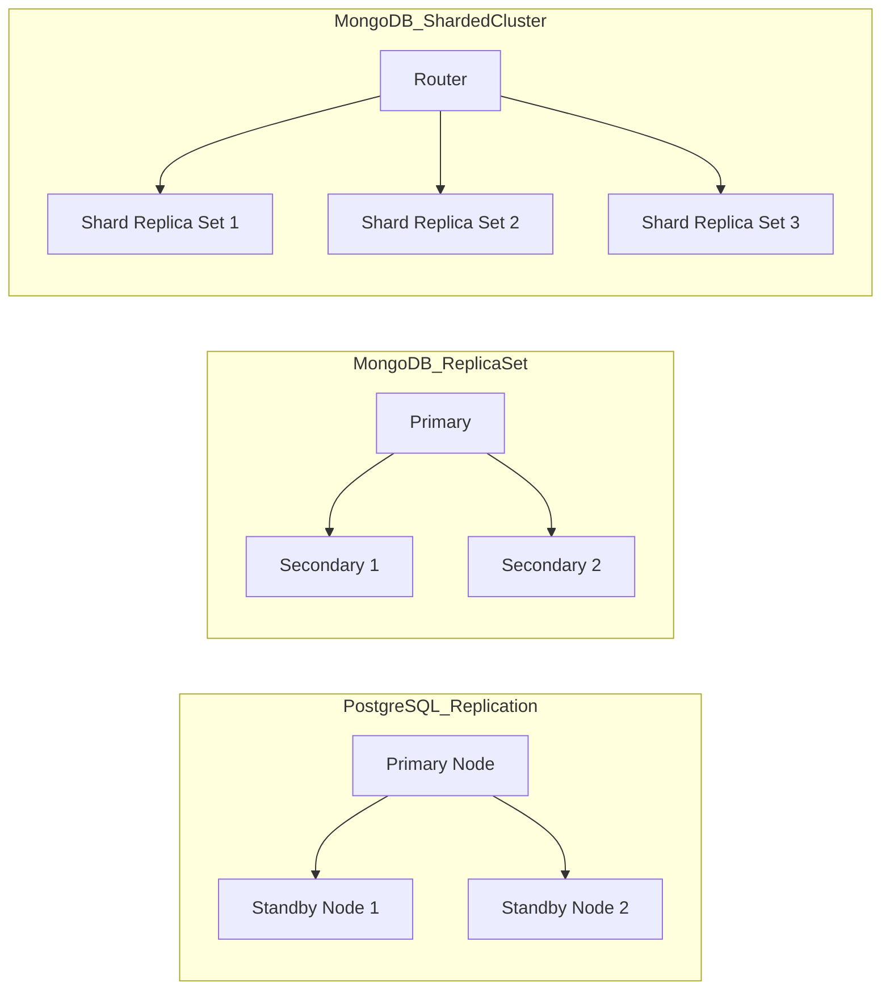

# So sánh về Tính năng Mở rộng và Khả năng Phân tán: PostgreSQL vs MongoDB

Trong bài viết này, ta sẽ **phân tích cách PostgreSQL và MongoDB xử lý việc mở rộng dữ liệu (data scaling)**, cả về **vertical scaling** (tăng cấu hình phần cứng) và **horizontal scaling** (replication và sharding). Ngoài ra, ta sẽ so sánh chi tiết về đặc điểm **cluster, replication, high availability, backup và recovery** giữa hai hệ quản trị cơ sở dữ liệu nổi tiếng này.

---

## 1. Giới thiệu chung về PostgreSQL và MongoDB

| Đặc điểm            | PostgreSQL                           | MongoDB                                  |
|---------------------|------------------------------------|------------------------------------------|
| Loại database       | Relational Database (RDBMS)        | NoSQL Document-oriented Database          |
| Mô hình dữ liệu     | Bảng, Row, Schema cố định           | Document JSON-like (BSON) linh hoạt      |
| Phù hợp với         | Ứng dụng yêu cầu tính nhất quán mạnh| Ứng dụng cần linh hoạt schema và mở rộng cao |

---

## 2. Vertical Scaling (Scale Up)

### PostgreSQL

- **Tăng hiệu năng server**: Tăng CPU, RAM, I/O để cải thiện hiệu năng xử lý truy vấn, viết dữ liệu.
- PostgreSQL tận dụng tốt phần cứng mạnh, tuy nhiên có giới hạn do kiến trúc đơn node (single-node server).
- Ví dụ: Nâng cấp Server từ 8 CPU, 16GB RAM lên 32 CPU, 128GB RAM giúp tăng khả năng xử lý, nhưng vẫn chỉ là một node.

### MongoDB

- Tương tự, MongoDB cũng hỗ trợ vertical scaling bằng cách nâng cấp cấu hình server.
- Tuy nhiên, MongoDB thường được khuyến nghị ưu tiên horizontal scaling hơn (sharding) do mô hình NoSQL.

---

## 3. Horizontal Scaling (Scale Out)

Horizontal scaling chia làm 2 loại chính:

- **Replication (sao chép dữ liệu)**
- **Sharding (chia nhỏ dữ liệu theo key)**

---

## 3.1. Replication

### PostgreSQL Replication

- PostgreSQL hỗ trợ replication dạng **Primary-Standby** (1 primary, nhiều standby read-only).
- Các kiểu replication phổ biến:
  - Streaming replication (log shipping, physical replica)
  - Logical replication (theo dõi từng thay đổi, data replication theo table)
- Dùng để:
  - Tăng khả năng đọc (read scaling)
  - High Availability (HA): chuyển sang standby khi primary lỗi.
- Không hỗ trợ replication đa chiều (multi-master) một cách mặc định.

#### Ví dụ cấu hình streaming replication đơn giản:

```bash
# Trên primary PostgreSQL (postgresql.conf)
wal_level = replica
max_wal_senders = 3
wal_keep_segments = 64
hot_standby = on

# Tạo user replication
CREATE ROLE replica WITH REPLICATION LOGIN PASSWORD 'password';

# Trên standby:
pg_basebackup -h primary_host -D /var/lib/postgresql/data -U replica -P --wal-method=stream
```

### MongoDB Replication

- MongoDB hỗ trợ **Replica Set** bao gồm:
  - 1 primary node (write/read)
  - N secondary node (read-only, sao chép primary)
- Replica Set có thể tự động chuyển đổi primary khi node chết (automatic failover).
- Hỗ trợ đa chiều (multi-primary) trong phiên bản MongoDB 5.0+ với sharded cluster.

#### Tạo replica set ví dụ:

```js
rs.initiate({
  _id: "rs0",
  members: [
    { _id: 0, host: "mongo1:27017" },
    { _id: 1, host: "mongo2:27017" },
    { _id: 2, host: "mongo3:27017" }
  ]
});
```

---

## 3.2. Sharding (Chia dữ liệu)

### PostgreSQL Sharding

- PostgreSQL không hỗ trợ sharding native (bản thân database engine không trực tiếp hỗ trợ).
- Các giải pháp sharding thường là:
  - Sử dụng các extension như **Citus** (một extension biến PostgreSQL thành distributed database).
  - Hoặc sharding logic do ứng dụng xử lý (application-level sharding).
- **Citus** cho phép phân tán table qua nhiều node, xử lý query phân tán, map-reduce.

#### Ví dụ (Citus):

```sql
-- Biến table post thành distributed
SELECT create_distributed_table('post', 'user_id');
```

- Nhược điểm: cần additional setup và không phải PostgreSQL gốc.

### MongoDB Sharding

- MongoDB hỗ trợ sharding native, cho phép chia dữ liệu tự động theo shard key.
- Mỗi shard là một replica set.
- MonggoDB balancer sẽ tự động phân phối dữ liệu khi kích thước dữ liệu lớn.
- Mô hình rất trực quan và dễ triển khai cluster lớn.

#### Ví dụ enable sharding:

```js
sh.enableSharding("myDatabase");
sh.shardCollection("myDatabase.myCollection", { user_id: 1 });
```

---

## 4. Cluster, High Availability và Replication So sánh

| Đặc điểm                  | PostgreSQL                                | MongoDB                                   |
|---------------------------|------------------------------------------|-------------------------------------------|
| Mô hình cluster            | Primary-Standby (Streaming replication) | Replica Set + Sharded Cluster             |
| High Availability (HA)    | Chuyển đổi thủ công với failover tool hoặc tự động với Patroni | Tự động failover, election trong Replica Set |
| Replication               | Physical/Logical replication              | Replica Sets                              |
| Scale reads               | Đọc replica (standby nodes)               | Đọc từ secondary hoặc primary             |
| Scale writes              | Chủ yếu trên primary, không scale write | Shard data, mỗi shard write độc lập      |

**Lưu ý**: MongoDB có lợi thế về scale out write khi dùng sharding, PostgreSQL phải rely vào extension hoặc giải pháp bên ngoài.

---

## 5. Backup và Recovery

### PostgreSQL Backup & Recovery

- Các phương án backup:
  - Logical Backup (pg_dump/pg_dumpall)
  - Physical Backup (pg_basebackup)
  - Point-in-Time Recovery (PITR) với WAL archive
- Backup thường dựa trên snapshot và WAL logs.
- Recovery khá chi tiết, có thể phục hồi đến thời điểm cụ thể.

### MongoDB Backup & Recovery

- Logical backup bằng `mongodump`/`mongorestore`.
- Physical backup dùng snapshot filesystem với WiredTiger engine.
- Với Replica Set, có thể thực hiện backup song song mà không ảnh hưởng đến hệ thống.
- Hỗ trợ **point-in-time backup** từ version 4.2+ với tính năng Change Streams.

---

## 6. Tổng hợp ưu nhược điểm về scaling, cluster và HA

| Tiêu chí                 | PostgreSQL                                  | MongoDB                                   |
|--------------------------|---------------------------------------------|-------------------------------------------|
| Vertical scaling         | Tốt, tận dụng CPU/RAM mạnh                  | Tốt, nhưng hướng đến horizontal scale    |
| Horizontal scaling       | Cần thêm tools như Citus, khó thiết lập      | Hỗ trợ native sharding & replication      |
| Cluster & HA             | Phức tạp hơn, cần tool hỗ trợ (Patroni, etc.) | Đơn giản, tự động với replica set          |
| Write scaling            | Khó mở rộng phân tán                        | Dễ dàng mở rộng nhờ sharding               |
| Backup & Recovery        | Rất mạnh, PITR hỗ trợ chi tiết              | Backup linh hoạt, hỗ trợ streaming change  |

---

## 7. Kết luận

| PostgreSQL | MongoDB |
|------------|----------|
| Phù hợp ứng dụng cần **ACID** mạnh mẽ, quan hệ phức tạp, read-write tập trung | Phù hợp ứng dụng cần **schema linh hoạt**, mở rộng write-read lớn, phân tán |
| Vertical scaling & replication tốt, tuy nhiên horizontal scaling cần thêm extension/giải pháp | Replica set + sharding hỗ trợ scale out ngang mạnh mẽ, đơn giản deploy cluster |
| Backup/recovery hỗ trợ mạnh mẽ, recovery đến thời điểm cụ thể (PITR)  | Backup thuận tiện, hỗ trợ backup online mà không làm gián đoạn dịch vụ |

---

# Diagram minh họa phân phối dữ liệu



---

Hy vọng bài viết giúp bạn hiểu được cách **PostgreSQL và MongoDB** xử lý vertical & horizontal scaling, cũng như các đặc điểm cluster, replication, HA, backup và recovery đặc trưng của từng hệ thống. Từ đó, bạn có thể lựa chọn phù hợp với bài toán phát triển hệ thống của mình!