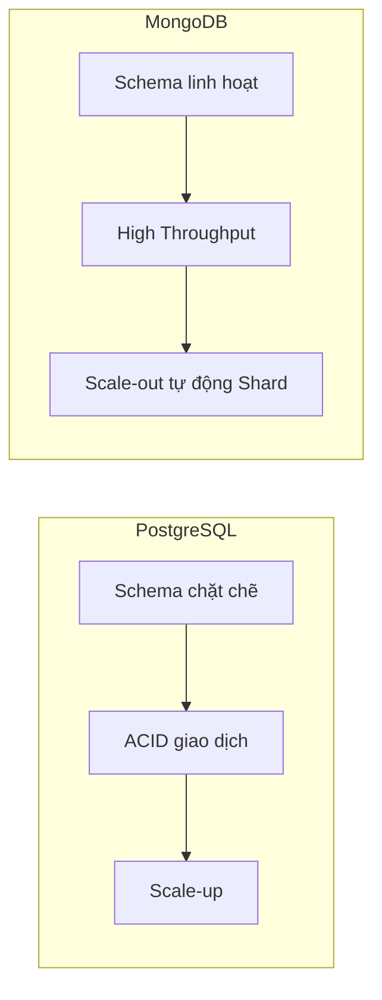

# Phân Tích Ưu Nhược Điểm Tổng Thể PostgreSQL và MongoDB: Lựa Chọn Dựa Trên Yêu Cầu Dự Án

Trong lĩnh vực quản lý cơ sở dữ liệu, PostgreSQL và MongoDB là hai hệ quản trị phổ biến với những đặc trưng hoàn toàn khác biệt. Việc lựa chọn giữa hai công nghệ này không chỉ dựa vào tính năng mà còn phải xét trên nhiều khía cạnh như tính nhất quán, hiệu năng, khả năng mở rộng, tốc độ phát triển, cộng đồng hỗ trợ, hệ sinh thái và chi phí vận hành.

---

## 1. Tổng Hợp Ưu Nhược Điểm

| Khía Cạnh            | PostgreSQL                                                  | MongoDB                                                     |
|----------------------|-------------------------------------------------------------|-------------------------------------------------------------|
| **Tính Nhất Quán**    | - Tuân thủ ACID mạnh mẽ. <br>- Giao dịch đa dòng (multi-row) an toàn. | - Tính nhất quán cuối cùng (eventual consistency) theo mặc định.<br>- Hỗ trợ giao dịch đa tài liệu từ phiên bản 4.0. |
| **Hiệu Năng**         | - Tốt trong các truy vấn phức tạp, join, transaction. <br>- Index đa dạng (B-tree, GIN, BRIN, ...). | - Tốt với các truy vấn đơn giản, đọc/ghi tài liệu nhanh.<br>- Đặc biệt phù hợp với dữ liệu phi cấu trúc (JSON-like). |
| **Khả Năng Mở Rộng**  | - Hướng theo mô hình scale-up (tăng tài nguyên server).<br>- Hỗ trợ phân mảnh giới hạn, cần công cụ bên ngoài như Citus cho scale-out. | - Thiết kế hỗ trợ scale-out native qua sharding. <br>- Thích hợp cho hệ thống yêu cầu mở rộng linh hoạt và tự động. |
| **Phát Triển Nhanh**  | - Dữ liệu có cấu trúc rõ ràng buộc chặt, chậm hơn khi thay đổi schema.<br>- Phù hợp dự án có schema ổn định. | - Lược bỏ schema chặt chẽ, dễ dàng thay đổi cấu trúc dữ liệu.<br>- Tăng tốc độ phát triển, đặc biệt trong giai đoạn prototype. |
| **Cộng Đồng Hỗ Trợ**  | - Cộng đồng lớn, lâu năm, nhiều tài liệu chất lượng.<br>- Nhiều extension được phát triển. | - Cộng đồng năng động, nhiều tài liệu online.<br>- Nhiều công cụ liên quan hiện đại hỗ trợ phát triển nhanh. |
| **Hệ Sinh Thái**      | - Hỗ trợ đa dạng, tích hợp tốt với các công cụ BI, ORM (SQLAlchemy, Hibernate). <br>- Nhiều extension như PostGIS hỗ trợ GIS. | - Hệ sinh thái đa dạng với driver cho đa ngôn ngữ.<br>- Tích hợp tốt với các framework đa nền tảng. |
| **Chi Phí Vận Hành**  | - Phần lớn là chi phí duy trì phần cứng và nhân sự có trình độ SQL.<br>- Khó mở rộng theo chiều ngang có thể tăng chi phí. | - Dễ dàng mở rộng theo chiều ngang giúp giảm chi phí hardware.<br>- Nhưng chi phí đồng bộ hoá sharding và nhân viên hiểu NoSQL có thể cao. |

---

## 2. Phân Tích Chi Tiết Các Khía Cạnh

### 2.1 Tính Nhất Quán

- **PostgreSQL**: Là database quan hệ truyền thống, PostgreSQL tuân thủ chặt chẽ các quy tắc ACID (Atomicity, Consistency, Isolation, Durability), đảm bảo dữ liệu nhất quán trong mọi trường hợp. Ví dụ, các giao dịch ngân hàng, sổ sách kế toán cần tính nhất quán tuyệt đối.

- **MongoDB**: Mặc định áp dụng mô hình **eventual consistency**, tuy nhiên từ phiên bản 4.0 trở đi, MongoDB hỗ trợ giao dịch đa tài liệu, gần như đáp ứng được ACID. Tuy nhiên, hệ thống vẫn ưu tiên mở rộng và hiệu năng hơn là tính nhất quán tuyệt đối.

**Ví dụ:**

```sql
-- PostgreSQL transaction
BEGIN;
UPDATE accounts SET balance = balance - 100 WHERE id = 1;
UPDATE accounts SET balance = balance + 100 WHERE id = 2;
COMMIT;
```

Trong khi đó, với MongoDB:

```javascript
const session = client.startSession();

session.withTransaction(async () => {
    await accountsCollection.updateOne({ _id: 1 }, { $inc: { balance: -100 } }, { session });
    await accountsCollection.updateOne({ _id: 2 }, { $inc: { balance: 100 } }, { session });
});
session.endSession();
```

---

### 2.2 Hiệu Năng

- PostgreSQL phù hợp với các truy vấn phức tạp như join, group by, phân tích dữ liệu nhờ optimizer và khả năng index đa dạng.

- MongoDB cực kỳ hiệu quả trong các ứng dụng read/write tốc độ cao, đặc biệt với dữ liệu dạng JSON, không cần join phức tạp.

---

### 2.3 Khả Năng Mở Rộng

- PostgreSQL chủ yếu dùng scale-up (cải thiện phần cứng) và scale-out với các công cụ bên ngoài (vd: Citus).

- MongoDB built-in hỗ trợ sharding, tự động phân phối dữ liệu, rất tốt cho ứng dụng yêu cầu mở rộng quy mô linh hoạt.

---

### 2.4 Phát Triển Nhanh

- MongoDB khởi đầu nhanh do không cần xác định schema cố định, dễ điều chỉnh khi thay đổi yêu cầu dự án.

- PostgreSQL cần thiết kế schema kỹ, bù lại hệ thống ổn định, ít lỗi liên quan đến dữ liệu.

---

### 2.5 Cộng Đồng Hỗ Trợ và Hệ Sinh Thái

- PostgreSQL tồn tại hơn 30 năm với kho extensions phong phú như PostGIS (GIS), TimescaleDB (time series), hỗ trợ ORM phổ biến.

- MongoDB có cộng đồng phát triển mạnh, nhiều thư viện tương thích đa ngôn ngữ, dịch vụ đám mây dễ dùng (MongoDB Atlas).

---

### 2.6 Chi Phí Vận Hành

- PostgreSQL: Có thể chạy trên máy chủ vật lý hoặc cloud, chi phí quản lý nhân sự chuyên sâu SQL và hardware scale-up cao.

- MongoDB: Dễ dàng mở rộng cloud tự động, tuy nhiên quản lý sharding, backup có thể gây khó khăn và tốn chi phí.

---

## 3. Lời Khuyên Thực Tế Khi Lựa Chọn PostgreSQL VS MongoDB

| Yêu Cầu Dự Án                    | Đề Xuất Sử Dụng                    | Lý Do                                                        |
|---------------------------------|-----------------------------------|--------------------------------------------------------------|
| Dữ liệu quan hệ phức tạp, cần ACID, giao dịch an toàn | **PostgreSQL**                    | Tính nhất quán cao, hỗ trợ giao dịch mạnh mẽ                |
| Ứng dụng tốc độ cao, dữ liệu phi cấu trúc thay đổi liên tục | **MongoDB**                      | Schema linh hoạt, Read/Write nhanh, mở rộng dễ dàng          |
| Dự án cần phân tích dữ liệu (BI/Analytics) copy từ OLTP | **PostgreSQL**                    | Hỗ trợ câu truy vấn phức tạp, nhiều extension phân tích      |
| Ứng dụng web/mobile prototype phát triển nhanh | **MongoDB**                      | Tăng tốc phát triển dự án, không cần thiết kế schema ban đầu |
| Hệ thống cần mở rộng quy mô linh hoạt theo chiều ngang | **MongoDB**                      | Sharding native, scale-out hiệu quả                           |
| Ứng dụng GIS hoặc time series chuyên sâu | **PostgreSQL + extension**       | PostGIS, TimescaleDB giúp mở rộng tính năng chuyên biệt      |
| Chi phí quản lý thấp, nhân sự nhiều kinh nghiệm SQL | **PostgreSQL**                    | Nắm rõ SQL, dễ tuyển dụng                                     |
| Chi phí hardware linh hoạt, dùng cloud dễ dàng | **MongoDB**                      | Cloud-native, scale-out tự động                               |

---

## 4. Tổng Kết

| Tổng quan | PostgreSQL                                   | MongoDB                                        |
|-----------|----------------------------------------------|------------------------------------------------|
| Ưu điểm  | Ổn định, ACID, phù hợp dữ liệu quan hệ       | Linh hoạt schema, mở rộng dễ, hiệu năng cao   |
| Nhược điểm| Mở rộng theo chiều ngang phức tạp, ít linh động trong schema | Nhất quán yếu hơn (trước 4.0), phức tạp khi quản lý sharding |
| Đối tượng | Hệ thống báo cáo, ngân hàng, ERP, OLTP       | Ứng dụng NoSQL, Big Data, Web, prototype nhanh |

**Vậy, khi bắt đầu một dự án, cần xem xét kỹ yêu cầu về tính nhất quán, cấu trúc dữ liệu, hiệu năng và quy mô hệ thống để chọn cho phù hợp. Không có công nghệ nào tốt nhất cho mọi trường hợp, chỉ có giải pháp phù hợp nhất.**

---

## 5. Phụ Lục: Mô Hình So Sánh Kiến Trúc (Diagram)



---

Hi vọng bài viết giúp bạn có cái nhìn tổng quan, sâu sắc hơn về PostgreSQL và MongoDB để lựa chọn đúng công cụ phù hợp dự án! Nếu cần code mẫu hoặc chạy thử, mình sẵn sàng hỗ trợ thêm.